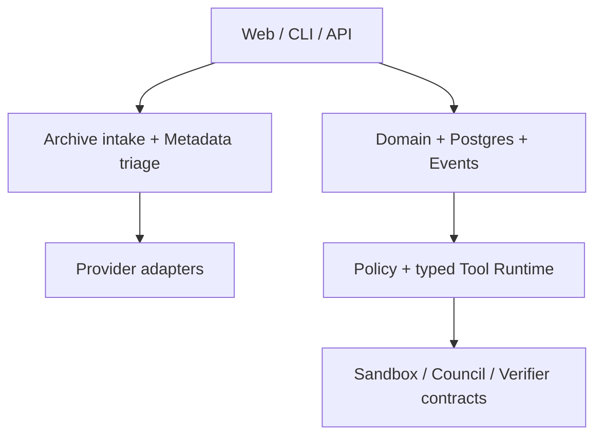
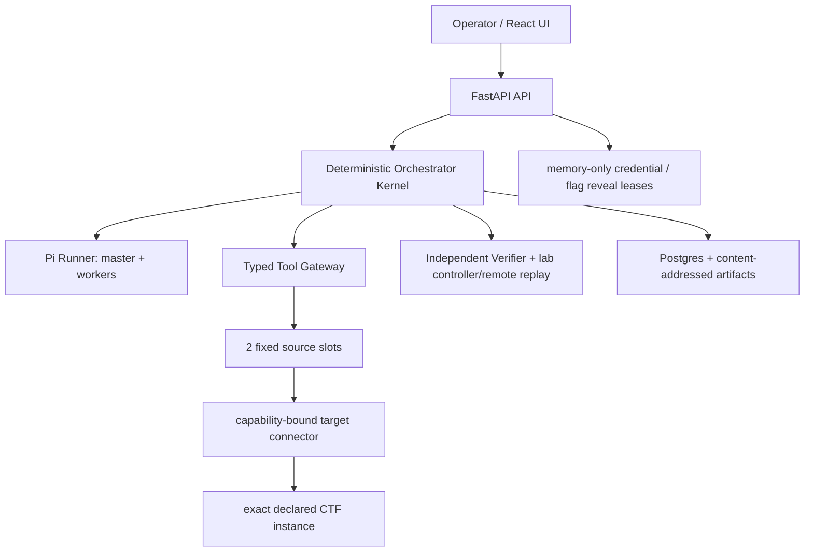
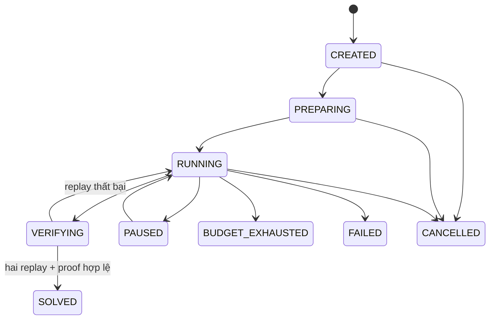

# CTFMesh → Pi CTF Agent v0.1

## Audit kiến trúc, thiết kế mục tiêu và ExecPlan để Codex triển khai

**Trạng thái:** Đang triển khai — Milestone 6, UI-driven exact-instance vertical slice
**Ngày chụp trạng thái:** 2026-08-31
**Đầu vào đã đọc:** `agentCTF.tar(2).gz`
**SHA-256 của gói đầu vào:** `e7285f25bc887779a3ffc6d09d7893d4e845b5f6e9f074646ef2582a86ffbcb5`
**Đối tượng đọc:** người phát triển và Codex
**Phạm vi an toàn:** chỉ dùng cho challenge CTF/lab được cấp quyền; không tự mở rộng sang mục tiêu thật.

---

> **Cách đọc tài liệu:** các mục 0–20 là snapshot audit/thiết kế tại thời điểm
> nhận gói nguồn và được giữ làm lịch sử quyết định. Trạng thái triển khai hiện
> hành nằm ở mục 21. Vì vậy các nhắc đến `CodexExecBackend`,
> `ScriptedCouncilBackend` hoặc đường chạy còn thiếu trong phần audit không mô
> tả source hiện tại; hai backend legacy đã bị loại ở pass hardening M6 ngày
> 2026-08-31 sau khi Pi/typed-runtime thay thế đầy đủ vai trò cần thiết.

## 0. Kết luận ngắn

Bộ mã hiện tại là một **nền tảng control-plane và triage read-only tốt**, chưa phải một CTF solver tự trị. Phần đáng giữ lại gồm domain contract, event/evidence, archive intake an toàn, policy/tool runtime typed, Postgres, API/CLI/UI và các provider adapter. Phần còn thiếu ở đường chạy thật là:

1. Không có run engine tự trị: tạo run mới chỉ ghi database.
2. Sandbox production cố ý fail-closed và chưa có runner.
3. Verifier mới là contract/test, chưa có driver reset/replay hoàn chỉnh.
4. `CodexExecBackend` vẫn cho tiến trình Codex dùng native tools; danh sách tool trong prompt không phải security boundary.
5. Idempotency, lock và budget của tool runtime còn nằm trong memory; restart có thể làm lặp side effect.
6. Council/scripted backend có contract nhưng không nối thành sản phẩm solver.

Vì vậy, không nên tiếp tục bằng cách thêm prompt, thêm model hay thêm provider. Hướng đúng cho v0.1 là một vertical slice chạy được:

> **Một master Pi điều phối tối đa hai worker Pi; Pi chỉ là cognitive/tool-call harness; một kernel Python xác định trạng thái, quyền, ngân sách và bằng chứng; tool chỉ chạy trong các slot Docker cố định; người điều khiển thêm Hint Card như một giả thuyết; chỉ verifier độc lập mới được đánh dấu `SOLVED`.**

Phạm vi v0.1 giữ **Web CTF source-available + HTTP**. Sau approval ngày 2026-08-31, thêm một lane `ui_exact_instance_v1` cho **assisted authorized Web CTF**: operator upload archive, khai báo đúng một instance origin, cấu hình credential vault RAM theo provider và chọn provider/model riêng từng pane; backend tự điều phối source slot, Pi và verifier. Không đưa shell tùy ý, Docker/Compose từ archive, pwn, reversing, browser automation hay public web search vào v0.1. `contest` vẫn không được phép public target; lane mới không là Internet client tổng quát.

Ước lượng hợp lý cho một người phát triển: **4–6 tuần**, chia thành bảy milestone có gate độc lập. Không lấy số model tự tuyên bố, text “flag found”, hay một lần chạy may mắn làm tiêu chí thành công.

---

## 1. Tôi đã kiểm tra những gì

### 1.1. Xử lý gói nguồn

- Kiểm tra trước đường dẫn trong tar: không có absolute path hoặc `..` traversal.
- Tách source để audit, loại `node_modules`, `.venv`, build cache ở lượt đầu.
- Gói nén khoảng 60 MB nhưng bung đầy đủ khoảng 246–290 MB, có hơn 17.000 entry chủ yếu do dependency/build cache được đóng gói cùng.
- Source hữu ích chỉ khoảng 2,3 MB, 157 file.

**Việc cần sửa ngay khi tiếp tục:** không commit/phát hành `.venv`, `node_modules`, `dist`, `__pycache__`, `.ruff_cache` và build artifact. Chỉ giữ lockfile. Việc đóng gói môi trường cũ còn tạo đường dẫn editable tuyệt đối, làm môi trường kiểm tra sau khi di chuyển bị hỏng dù source không sai.

### 1.2. Quality gate đã chạy

| Hạng mục | Kết quả audit |
|---|---:|
| Python tests | `170 passed` |
| Ruff lint | Pass |
| Ruff format check | Pass, 100 file đã đúng format |
| Pyright | 0 error, 0 warning sau khi trỏ đúng source path của bản giải nén |
| `uv lock --check --offline` | Pass, lock hợp lệ |
| TypeScript `noEmit` | Pass |
| Vitest | `13 passed` |
| Vite production build | Pass |
| Docker smoke | Chưa chạy được trong môi trường audit vì không có Docker/Podman binary |

Kết luận từ gate: nền code sạch và có kỷ luật test. Vấn đề chính là **độ hoàn chỉnh của kiến trúc runtime**, không phải code quality cơ bản.

---

## 2. Kiến trúc và ý tưởng hiện tại

### 2.1. Các khối đang có



| Khối | Trạng thái thực tế | Nhận xét |
|---|---|---|
| `apps/api` | Chạy được | CRUD challenge/run và steering event; chưa launch solver loop |
| `apps/cli` | Chạy được | Hữu ích cho local operator và test |
| `apps/web` | Chạy được | Có run controls; hành động chủ yếu ghi event |
| `packages/domain` | Tốt | Pydantic contracts rõ, nên tiếp tục làm nguồn chân lý |
| `packages/db` | Tốt nhưng chưa đủ | Postgres và event payload digest; chưa có durable job/lease/budget/idempotency |
| `packages/events` | Hữu ích | Nên mở rộng thành audit/event stream của run engine |
| `packages/policy` | Tốt | Đúng hướng fail-closed |
| `packages/tools/base` | Nền tốt | Typed input/output, policy gate, file/HTTP/artifact tools; cache/lock còn in-memory |
| `packages/providers/*` | Hoạt động cho triage | Nhiều provider nhưng chưa tạo lợi ích solve end-to-end |
| `CodexExecBackend` | Adapter thử nghiệm | Không được dùng làm product security boundary |
| `packages/skills` | Catalog lớn | Có giá trị nội dung, nhưng cần đổi thành skill/hint pack nhỏ theo task |
| `services/orchestrator` | Read-only triage | Chưa phải stateful solver orchestrator |
| `services/tool-runtime` | Gần như placeholder | Chưa có service runtime production |
| `packages/sandbox` | Contract/fail-closed | Đây là hành vi an toàn, nhưng chưa giải quyết execution |
| `services/verifier` | M5 driver + declarative HTTP parser | Reset/replay hai lần cho đúng ba local lab đã allowlist; không generic target verifier |
| `packages/evaluation` | Paired triage metrics | Chưa đo verified solve loop |
| `docker-compose.yml` | Control-plane + M3/M5 profile opt-in | Không Redis/MinIO; Web ingress loopback, provider/lab network tách riêng |

### 2.2. Đường chạy hiện tại dừng ở đâu

`POST create_run` trong `apps/api/src/ctfmesh_api/app.py` tạo record và trả về. Pause/resume/cancel/steer ghi trạng thái hoặc event, nhưng không có tiến trình claim run, tạo branch, gọi worker, nhận tool result, đề xuất exploit và gọi verifier.

`packages/providers/base/.../council.py` định nghĩa council contracts và `ScriptedCouncilBackend`; test dùng nó, production không có solver council. `packages/providers/base/.../worker.py` có `CodexExecBackend`, nhưng adapter này gọi `codex exec --json` và vẫn để native tools hoạt động. Việc đặt `allowed_tools` trong prompt chỉ là hướng dẫn cho model, không chặn process thật.

`packages/sandbox/.../unavailable.py` từ chối chạy vì chưa có approved rootless OCI runner. Đây là lựa chọn đúng về safety, nhưng cũng có nghĩa dự án chưa thể thực thi action của solver.

`services/verifier` hiện có M5 controller và worker riêng: controller tạo flag
ngẫu nhiên mỗi reset trên target-only volume, verifier replay plan khai báo hai
lần với cookie jar mới và kiểm proof Ed25519 bằng public key. Đường này cố ý chỉ
bind ba lab Web local do dự án sở hữu; không biến service thành generic target
driver hoặc chạy Python do model sinh.

### 2.3. Điểm mạnh về ý tưởng

- “Verifier mới có quyền kết luận solved” là invariant đúng.
- Archive intake có kiểm tra traversal, link, special file và archive bomb.
- Provider URL/credential handling không để người dùng tùy ý biến hệ thống thành SSRF/open proxy.
- Tool contracts typed và policy gate là nền tốt cho model yếu.
- Evidence/artifact được coi là đối tượng domain, thay vì chỉ giữ transcript.
- `AGENTS.md` đã đặt ranh giới authorized CTF, deny network mặc định, tránh `shell=True`, append-only và sandbox cho code không tin cậy.

### 2.4. Bản đồ source đã audit

| Path | Quan sát | Khuyến nghị |
|---|---|---|
| `apps/api/src/ctfmesh_api/app.py` | Create/pause/resume/cancel/steer tồn tại; chưa có launcher/claim loop cho run | Gọi `RunEngine.start()` và internal job queue ở Milestone 1 |
| `services/orchestrator/src/ctfmesh_orchestrator/triage.py` | Hướng read-only triage | Giữ preflight logic, thêm `run_engine.py`, scheduler, lease, context builder |
| `packages/providers/base/.../worker.py` | `CodexExecBackend` gọi `codex exec --json`; prompt có allowlist nhưng native tools không tắt | Đánh dấu legacy/dev-only; thêm Pi Runner tách process/quyền |
| `packages/providers/base/.../council.py` | Contracts và `ScriptedCouncilBackend`, không phải production solver | Đổi council thành event-triggered falsifier policy |
| `packages/sandbox/src/.../unavailable.py` | Fail-closed vì thiếu approved rootless OCI runner | Giữ fail-closed; dùng fixed typed Docker slot cho Web-only v0.1 |
| `packages/tools/base/src/ctfmesh_tools/runtime.py` | Typed runtime/policy tốt; cache/lock/idempotency in-memory | Di chuyển state nhạy cảm vào Postgres transaction |
| `packages/tools/base/src/ctfmesh_tools/http.py` | Có exact host allowlist, session, bounded HTTP transport | Giữ, chỉ wiring target manifest + slot network |
| `services/verifier/src/ctfmesh_verifier/service.py` | Có parser HTTP plan declarative và verifier independence | Bổ sung lab reset/driver, two clean replay, proof |
| `packages/skills/base/.../registry.py` | Catalog guidance static khá lớn | Tách pack nhỏ theo role/technique, có version/digest |
| `packages/db/src/ctfmesh_db/models.py` | Nền persistence/event tốt | Thêm runtime table/lease/outbox/ledger/append-only enforcement |
| `docker-compose.yml` | Có Postgres/Redis/MinIO/API/Web; Redis/MinIO không có consumer source | Tách compose v0.1, hoãn dependency chưa dùng, thêm network boundary/slots |
| `packages/evaluation` | Đo paired triage | Thêm verified solve/replay/regression eval |

Những nguyên tắc này nên được giữ, không viết lại toàn bộ repo.

---

## 3. Vấn đề cần ưu tiên

### P0 — chặn một bản solver đúng nghĩa

1. **Thiếu deterministic run kernel.** LLM không được sở hữu state machine, budget, lease hay quyền kết luận.
2. **Thiếu đường tool execution production.** Contract không thay thế runner.
3. **Thiếu verifier driver.** “Candidate có vẻ đúng” chưa phải solve.
4. **Backend hiện tại có native tools ngoài policy.** Đây là đường bypass rõ nhất.
5. **Context của worker là `dict` tùy ý.** Không có giới hạn, provenance, digest hoặc chiến lược truncation.

### P1 — làm agent yếu tốn token và dễ ảo giác

1. Model nhận nhiệm vụ rộng thay vì một decision nhỏ.
2. Không có blackboard phân biệt `hypothesis`, `observation`, `confirmed fact`, `candidate`.
3. Không có fingerprint attempt để ngăn lặp payload/tool call.
4. Council thường trực dễ tạo “đồng thuận giả”: nhiều agent lặp lại một claim không tạo thêm bằng chứng.
5. Skill catalog quá rộng nếu đưa nhiều mục vào cùng prompt.
6. Chưa có deterministic preflight để model khỏi tốn token vào liệt kê file, nhận diện framework, route và dependency.

### P1 — độ bền vận hành

- Idempotency cache và locks nằm trong process.
- Budget có trong context nhưng chưa có atomic debit ở tool boundary.
- Event log là logical append-only; chưa có DB trigger/role enforcement và chuỗi hash liên kết.
- Redis/MinIO làm compose nặng nhưng chưa có consumer thực.
- Control network đang có external connectivity; chưa tách provider egress khỏi challenge network.

### P2 — nợ dự án

- Plan cũ hơn 5.400 dòng giàu ý tưởng nhưng quá rộng. Thứ tự triển khai đã trôi sang UI/provider/skills trước sandbox, verifier và autonomous loop.
- Gói phát hành chứa dependency/cache.
- Có nhiều abstraction “sẽ dùng sau” hơn đường vertical slice hiện tại cần.

---

## 4. Quyết định giữ, sửa và hoãn

| Quyết định | Thành phần | Hành động v0.1 |
|---|---|---|
| **Giữ** | Pydantic domain contracts | Mở rộng, không thay framework |
| **Giữ** | FastAPI, React, Postgres | Tiếp tục làm control plane/UI/source of truth |
| **Giữ** | Archive intake | Dùng làm preflight; materialize archive đã validate vào fixed source-slot volume, không thực thi nội dung |
| **Giữ** | Policy + typed tools | Đưa vào đường chạy production |
| **Giữ** | Evidence/artifact/event model | Thêm provenance, context manifest, durable attempt |
| **Giữ** | Verifier declarative plan | Hoàn thiện driver cho local lab và two-clean-replay exact remote Web target |
| **Sửa** | `services/orchestrator` | Từ triage service thành deterministic run kernel |
| **Sửa** | Worker backend | Thêm `PiHarnessBackend`; giữ Codex adapter chỉ làm legacy/dev |
| **Sửa** | Council | Đổi thành falsifier theo gate, không chạy tranh luận liên tục |
| **Sửa** | Static skill registry | Chuyển thành skill pack + Hint Template nhỏ, có version/digest |
| **Sửa** | Tool runtime | Durable idempotency/budget/lease và fixed sandbox slots |
| **Sửa** | Events | DB-enforced append-only + `prev_hash`/`event_hash` |
| **Hoãn** | Redis | Dùng Postgres job table/outbox trong v0.1 |
| **Hoãn** | MinIO | Dùng content-addressed local volume; thêm object store khi multi-host |
| **Hoãn** | Arbitrary shell/Python | Chỉ typed source/HTTP/transform tools trong v0.1 |
| **Hoãn** | Pwn/rev/crypto/forensics đầy đủ | Sau khi có sandbox động v0.2 |
| **Hoãn** | Kubernetes/Temporal/distributed swarm | Không cần cho local-first |
| **Hoãn** | Worker chat trực tiếp | Mọi kết quả đi qua blackboard/kernel |

---

## 5. Bài học từ Pi và nghiên cứu CTF

### 5.1. Pi nên đóng vai trò gì

Pi có SDK để nhúng `AgentSession`, quản lý lifecycle/history/model/compaction, nhận event và gọi custom tools. SDK cũng hỗ trợ `prompt`, `steer`, `followUp`, `abort`; custom `ResourceLoader` cho phép kiểm soát system prompt, skills, extensions và context files. Đây là lý do chọn **SDK Node/TypeScript** thay vì bọc CLI bằng subprocess cho đường chính. Xem [Pi SDK](https://pi.dev/docs/latest/sdk).

Nhưng Pi không phải sandbox hay permission system. Tài liệu Pi nói rõ prompt injection không thể được ngăn đáng tin chỉ bằng prompt và code không tin cậy cần được cô lập bằng container/VM. Extensions cũng chạy với đầy đủ quyền của process. Xem [Pi Security](https://pi.dev/docs/latest/security), [Pi Containerization](https://pi.dev/docs/latest/containerization) và [Pi Extensions](https://pi.dev/docs/latest/extensions).

Từ đó có năm quyết định:

1. Pi là **cognitive loop và tool-call harness**, không phải policy authority.
2. Dùng `noTools: "all"`; chỉ đăng ký custom tools của CTFMesh.
3. Không chạy Pi với `cwd` là thư mục challenge và không dùng default resource discovery. Challenge có thể chứa `.pi/`, `.agents/skills` hoặc `AGENTS.md` độc hại. Dùng custom reviewed `ResourceLoader` từ image immutable.
4. Pi runner không mount challenge, không có Docker socket và không vào challenge network.
5. Không deep-fork Pi ở v0.1. Pin package và commit/tag đã test; nếu buộc fork thì giữ patch queue tối thiểu và compatibility test. Tại ngày audit, snapshot phù hợp là `@earendil-works/pi-coding-agent@0.84.2`; trước khi code phải xác nhận lockfile/tag tương ứng trên [Pi releases](https://github.com/earendil-works/pi/releases).

### 5.2. Bài học chống ảo giác

Nghiên cứu EnIGMA mô tả hiện tượng model tự “sáng tác” observation thay vì tương tác môi trường; interactive tools cải thiện đáng kể kết quả. Hệ quả thiết kế: **text của model không bao giờ được nâng thành observation**; chỉ tool event có provenance mới làm được. Xem [EnIGMA](https://arxiv.org/abs/2409.16165).

Cybench đưa ra intermediary subtasks để đo tiến độ và so sánh scaffolding. Hệ quả: task worker phải nhỏ, có required evidence và success condition rõ, thay vì “hãy solve challenge”. Xem [Cybench](https://arxiv.org/abs/2408.08926).

CTFusion chỉ ra benchmark CTF tĩnh dễ nhiễm contamination/web-search. Hệ quả: eval v0.1 phải tắt Internet, dùng flag ngẫu nhiên, seed giữ kín và lab synthetic/permuted thay vì chỉ chạy bộ public. Xem [CTFusion](https://arxiv.org/html/2605.11504v2).

Kiến trúc coordinator + nhiều solver độc lập trong [Veria Labs CTF Agent](https://github.com/verialabs/ctf-agent) là nguồn tham khảo hữu ích cho branch racing và operator messaging. Không nên sao chép mô hình “nhiều agent đồng thuận”; CTFMesh sẽ giữ một master, worker độc lập và evidence gate.

### 5.3. Bài học từ Docker

Docker khuyến nghị rootless mode để daemon và container chạy trong user namespace không-root. Compose network mặc định có external connectivity; `internal: true` mới tạo network cô lập bên ngoài. Quyền truy cập Docker daemon/socket tương đương quyền rất cao trên host, nên không container agent nào được nhận socket hoặc client certificate của daemon. Xem [Docker Rootless](https://docs.docker.com/engine/security/rootless/), [Compose networks](https://docs.docker.com/reference/compose-file/networks/) và [Protect the Docker daemon socket](https://docs.docker.com/engine/security/protect-access/).

V0.1 tránh hoàn toàn dynamic `docker run` từ agent: Compose tạo sẵn hai sandbox slot và một verifier slot. Đây là trade-off có chủ đích để local deployment không phải mount `/var/run/docker.sock` hay chạy Docker-in-Docker privileged.

### 5.4. Cách viết kế hoạch cho Codex

Codex đọc chỉ dẫn theo hierarchy của `AGENTS.md`; kế hoạch dài nên là một ExecPlan tự chứa, có progress, decision log, acceptance và recovery. Xem [AGENTS.md guidance](https://developers.openai.com/codex/agent-configuration/agents-md) và [Codex ExecPlans](https://developers.openai.com/cookbook/articles/codex_exec_plans). File này được viết theo kiểu đó: Codex triển khai milestone chưa hoàn thành đầu tiên, chạy gate, rồi cập nhật plan.

---

## 6. Phạm vi sản phẩm v0.1

### 6.1. User story duy nhất phải chạy end-to-end

1. Operator khởi động toàn hệ thống bằng Docker Compose local.
2. Operator chọn một Web CTF lab/source archive đã được intake validate.
3. Operator tạo run với một model nhỏ/yếu và budget.
4. Deterministic preflight tạo inventory, routes, dependency signals và evidence ban đầu.
5. Master Pi tạo tối đa hai branch khác họ kỹ thuật.
6. Hai worker Pi dùng typed source/HTTP tools; mọi call đi qua kernel và sandbox slot.
7. Operator có thể gắn Hint Card, ví dụ “nghi ngờ path traversal”, cho cả run hoặc component.
8. Kernel biến hint thành hypothesis/branch priority; worker phải kiểm chứng bằng tool.
9. Worker tạo `ExploitPlan` khai báo, không gửi arbitrary code.
10. Verifier reset lab, replay plan hai lần với session sạch và kiểm tra flag qua lab controller.
11. Chỉ sau hai replay thành công, run chuyển `SOLVED` và UI hiển thị evidence chain.

### 6.2. In scope

- Linux/macOS/Windows Docker Desktop local; ưu tiên Linux rootless.
- Một người vận hành, một máy.
- Web CTF source-available hoặc source + local HTTP target.
- Hai worker song song, một falsifier theo nhu cầu.
- OpenAI-compatible provider qua Pi, model được cấu hình rõ.
- Source tools: list, read bounded slice, search, manifest/dependency inspection.
- HTTP tools: request bounded, cookie jar theo branch, no redirect mặc định, exact target allowlist.
- Deterministic transforms: URL/base64/hex/hash/JWT decode không xác minh chữ ký.
- Declarative exploit plan và independent verifier.
- Human Hint Cards, pause/resume/cancel, event stream, evaluation report.

### 6.3. Out of scope

- Tấn công Internet hoặc host ngoài manifest.
- Arbitrary bash/Python do model sinh.
- Pwn, kernel, malware, password cracking, browser automation.
- Multi-tenant, hostile SaaS hoặc cam kết container là ranh giới tuyệt đối.
- Dynamic container creation, Docker socket trong service.
- Auto-install Pi extensions/skills từ challenge hoặc Internet.
- Long-term memory giữa challenge ngoài curated skill metrics.
- Redis, MinIO, Kubernetes, distributed queues.

### 6.4. Threat model v0.1

- Challenge files và HTTP response là **untrusted content** và có thể chứa prompt injection.
- Pi extension, system prompt, skill pack và image do maintainer review, ký digest và coi là trusted code.
- Model có thể gọi sai tool, lặp call, dựng evidence ID, cố vượt scope hoặc trả flag giả.
- Target lab có thể bị agent làm hỏng; phải reset được.
- Local operator và control-plane image được tin cậy.
- Docker là defense-in-depth cho lab giáo dục, không phải security claim cho hostile multi-tenant workload. Với binary tùy ý ở tương lai phải thêm VM/gVisor/Kata hoặc host sandbox daemon được harden riêng.

---

## 7. Kiến trúc mục tiêu

### 7.1. Nguyên tắc phân quyền

| Thành phần | Được quyền | Không được quyền |
|---|---|---|
| Master Pi | Chọn branch/task, phân budget mềm, yêu cầu verify | Gọi HTTP target, đọc file challenge trực tiếp, kết luận `SOLVED` |
| Worker Pi | Gọi tool theo role/task, nộp finding/experiment/candidate | Tạo worker khác, sửa state run, nói chuyện trực tiếp với worker khác |
| Orchestrator Kernel | State transition, lease, budget, policy, context, schedule | Suy luận lỗ hổng bằng LLM |
| Tool Runtime / Sandbox Slot | Thực thi typed tool trong exact scope | Có provider key, Docker socket, direct Internet hoặc DB credential |
| Target connector | Chỉ relay capability-bound exact target request | Nhận URL tự do, redirect, secret/provider key, quyền state run |
| Verifier | Reset/replay `ExploitPlan`, xác minh flag | Nhận transcript/model reasoning, dùng candidate text làm bằng chứng |
| Operator | Chọn challenge/model/budget, gắn hint, pause/cancel | Biến hint thành confirmed fact mà không có evidence |

Một câu dễ nhớ: **Pi đề xuất; kernel quyết định; tool quan sát; verifier kết luận.**

### 7.2. Sơ đồ service



Pi Runner không nằm trên đường target network. Khi model gọi custom tool, Pi Runner gửi request typed về kernel. Kernel kiểm tra task lease, allowed tool, schema, budget, target scope và idempotency; sau đó Tool Gateway mới gọi sandbox slot. Kết quả được lưu thành artifact/evidence trước khi trả lại model.

### 7.3. Service boundary v0.1

| Service | Công nghệ | Trách nhiệm | Secret/network |
|---|---|---|---|
| `web` | React/Vite | UI run, evidence, Hint Deck | Chỉ gọi API qua loopback |
| `api` | FastAPI | Public/local API, SSE, auth local, validation, slot materialization | Không provider key environment/Docker socket; request-local key chỉ relay vào Pi memory lease |
| `orchestrator` | Python | Kernel, scheduler, DB job/outbox, context builder | DB credential; control net |
| `pi-runner` | Node/TS + Pi SDK | Session master/worker, event bridge, custom tools | Provider key; control + provider-proxy net; không challenge mount |
| `provider-proxy` | Allowlist CONNECT proxy | Chỉ cho endpoint model đã cấu hình | External egress duy nhất |
| `tool-gateway` | Python | Durable tool dispatch đến đúng slot | Control + từng slot net; không provider key |
| `sandbox-source-1/2` | Python minimal image | Source/HTTP/transform tools theo lease | Internal slot net; không direct Internet/secret |
| `target-connector` | Python | Relay HTTP exact-capability tới public instance | Egress riêng; không DB, source, provider key, run authority |
| `verifier` | Python | Reset/replay typed plan hai lần | Verify net/remote connector; không model/provider key |
| `lab-controller` | Python | Tạo flag ngẫu nhiên, reset state, validate flag | Admin/verify net; worker không thấy |
| `lab-target` | Sample vulnerable app | Mục tiêu CTF local | Chỉ các challenge/verify nets |
| `postgres` | PostgreSQL | Source of truth | Control DB net; không publish port mặc định |

`api` và `orchestrator` có thể cùng image/process ở milestone đầu để giảm vận hành, nhưng module boundary và internal interface vẫn phải rõ. Không cho `pi-runner` ghi DB trực tiếp.

### 7.4. Network layout Docker Compose

| Network | `internal` | Thành viên | Mục đích |
|---|---:|---|---|
| `ui-ingress` | false, no masquerade | web | Chỉ ingress loopback tới static Web reverse proxy |
| `frontend` | true | web, api | UI → API |
| `control` | true | api, orchestrator, pi-runner, tool-gateway | Control messages |
| `db` | true | orchestrator/api, postgres | DB only |
| `provider` | true | api, pi-runner, provider-proxy | Request-local browser triage và Pi chỉ ra ngoài qua proxy |
| `provider-public` | false | provider-proxy | External egress duy nhất |
| `slot-1` | true | tool-gateway, sandbox-1, lab-target | Worker slot 1 → target |
| `slot-2` | true | tool-gateway, sandbox-2, lab-target | Worker slot 2 → target |
| `verify-controller` | true | verifier, lab-controller | Reset/proof private; controller không thấy target/Pi/provider/control |
| `verify-lab-path` | true | verifier, `lab-path-traversal` | Replay độc lập tới một lab duy nhất |
| `verify-lab-authz` | true | verifier, `lab-authz-boundary` | Replay độc lập tới một lab duy nhất |
| `verify-lab-sqli` | true | verifier, `lab-sqli-basic` | Replay độc lập tới một lab duy nhất |

Chỉ publish `127.0.0.1:${WEB_PORT}`; Web reverse proxy `/v1/` tới API nội bộ. Không publish API, Postgres, tool, sandbox, Pi Runner, lab controller hoặc verifier.

V0.1 dùng hai slot khai báo tĩnh. Không service nào mount `/var/run/docker.sock`, rootless socket hay client key daemon. Máy Linux nên chạy Docker rootless. Docker Desktop cần cập nhật bản vá và repo phải ghi rõ threat-model hạn chế.

Hardening baseline cho mọi sandbox/verifier service:

```yaml
read_only: true
user: "65532:65532"
cap_drop: ["ALL"]
security_opt:
  - no-new-privileges:true
pids_limit: 128
mem_limit: 512m
cpus: 1.0
tmpfs:
  - /tmp:rw,noexec,nosuid,size=64m
  - /work:rw,noexec,nosuid,size=128m
init: true
stop_grace_period: 3s
```

Không chỉ dùng `deploy.resources`, vì Compose implementation có thể bỏ qua `deploy`; dùng thêm các service-level limits và có integration test đọc `docker inspect` để xác nhận.

### 7.5. Vì sao không để master trực tiếp dùng tool CTF

- Master có context rộng, dễ bị prompt injection hơn.
- Nếu master vừa quyết định vừa quan sát, claim sai có thể tự củng cố trong cùng transcript.
- Tách worker cho phép session mới, prompt ngắn, tool set nhỏ và branch độc lập.
- Master chỉ nhận evidence card đã normalize, không nhận raw output dài.
- Khi worker bị kẹt hoặc context bẩn, có thể bỏ session mà không mất state run.

---

## 8. Mô hình domain và invariant

### 8.1. State machine của run



`SOLVED`, `FAILED`, `CANCELLED`, `BUDGET_EXHAUSTED` là terminal. Chỉ verifier result có `verification_proof_ref` hợp lệ mới cho transition `VERIFYING → SOLVED`.

### 8.2. Epistemic model — lớp chống ảo giác cốt lõi

| Loại | Ai tạo | Có được coi là sự thật? | Ví dụ |
|---|---|---:|---|
| `Hypothesis` | model hoặc operator hint | Không | “route này có thể path traversal” |
| `Observation` | tool runtime | Có, trong phạm vi output đã ghi | HTTP 200, body digest X |
| `ConfirmedFact` | deterministic rule trên observations | Có | payload A đọc được file canary |
| `Finding` | worker | Không tự động | kết luận có evidence refs |
| `Candidate` | worker | Không | một `ExploitPlan` đề nghị verify |
| `VerificationProof` | verifier | Có | replay 1/2, target reset IDs, flag proof |

Model text chỉ được lưu ở event `agent.message`; nó không tạo observation. Evidence reference không tồn tại, sai run, sai challenge digest hoặc ngoài context manifest phải bị reject.

### 8.3. Contract tối thiểu

Các schema dưới đây là mô tả bắt buộc; tên field có thể tinh chỉnh nhưng semantics không được thay đổi âm thầm.

#### `ContextManifest`

```json
{
  "id": "ctx_...",
  "run_id": "run_...",
  "task_id": "task_...",
  "challenge_digest": "sha256:...",
  "role": "source_auditor",
  "objective": "Kiểm chứng giả thuyết H7",
  "allowed_tool_ids": ["source.search", "source.read", "finding.submit"],
  "evidence_refs": ["ev_..."],
  "hypothesis_refs": ["hyp_..."],
  "active_hint_refs": ["hint_..."],
  "attempt_fingerprints": ["sha256:..."],
  "budget_slice": {"tool_calls": 8, "input_tokens": 12000, "output_tokens": 1800},
  "created_at": "...",
  "expires_at": "...",
  "digest": "sha256:..."
}
```

Không còn `WorkerTask.context: dict` tùy ý. Mọi context phải có manifest, digest, byte/token cap và provenance.

#### `WorkerTask`

```json
{
  "id": "task_...",
  "run_id": "run_...",
  "branch_id": "branch_...",
  "role": "http_tester",
  "objective": "Thử một probe phân biệt path normalization",
  "required_evidence": ["status", "response_digest", "control_comparison"],
  "context_manifest_id": "ctx_...",
  "lease_version": 3,
  "deadline_at": "..."
}
```

#### `FindingSubmission`

```json
{
  "task_id": "task_...",
  "hypothesis_id": "hyp_...",
  "verdict": "supported | contradicted | inconclusive",
  "summary": "Tối đa 500 ký tự",
  "evidence_refs": ["ev_..."],
  "next_experiment": {"tool_id": "http.request", "purpose": "..."},
  "confidence": "low | medium | high"
}
```

`confidence` chỉ là self-report để xếp hàng; không thay thế evidence.

#### `ExploitPlanV1`

```json
{
  "schema_version": "ctfmesh.exploit-plan.v1",
  "challenge_digest": "sha256:...",
  "technique_id": "web.path_traversal",
  "steps": [
    {
      "op": "http.request",
      "method": "GET",
      "path": "/download",
      "query": {"file": "${payload}"},
      "capture": {"flag": "regex:CTF\\{[^}]{1,128}\\}"}
    }
  ],
  "assertions": ["capture.flag exists"],
  "evidence_refs": ["ev_..."],
  "digest": "sha256:..."
}
```

Plan không chứa host tùy ý, JavaScript, shell, Python, redirect follow, file write hoặc dynamic import. Target base URL đến từ immutable challenge manifest.

### 8.4. Database additions

Tạo migration mới, không sửa migration lịch sử. Tối thiểu cần:

| Bảng | Trường/constraint quan trọng |
|---|---|
| `run_branches` | run, family, state, priority, novelty, unique active family rule mềm |
| `worker_tasks` | branch, role, manifest, lease owner/version/expiry, attempts, state |
| `agent_sessions` | harness, role, model config digest, Pi session ref/digest, state |
| `agent_jobs` | kind, payload ref, state, lease, idempotency key |
| `tool_invocations` | normalized input digest, policy decision, budget debit, result/evidence ref |
| `idempotency_records` | unique `(run_id, scope, key)`, result ref |
| `budget_ledger` | atomic debit/credit entries, dimensions, remaining snapshot |
| `hypotheses` | origin, status, technique, scope, support/contradict refs |
| `hint_cards` | template/version, directive, target, priority, lifecycle, actor |
| `context_manifests` | canonical JSON, digest, size, refs, expiry |
| `exploit_candidates` | plan ref/digest, verification state |
| `verification_attempts` | reset id, replay index, result, proof ref |
| `outbox` | event type, payload ref, published timestamp, retry count |

Mọi mutation liên quan state + event/outbox phải nằm trong cùng transaction. Claim task dùng row lock/lease và compare-and-swap version. Tool budget debit và idempotency record phải commit trước khi dispatch; timeout không được tự động chạy lại tool side-effectful nếu trạng thái không rõ.

### 8.5. Event names bắt buộc

```text
run.created
run.preflight.completed
run.state.changed
branch.created
branch.prioritized
task.queued
task.leased
task.completed
task.expired
agent.session.started
agent.turn.completed
agent.schema_repair.requested
tool.requested
tool.policy_denied
tool.completed
evidence.recorded
hypothesis.created
hypothesis.status_changed
human.hint_card.added
human.hint_card.updated
candidate.submitted
verification.started
verification.replay_completed
verification.completed
budget.debited
run.stopped
```

Event payload dùng canonical JSON. Thêm `prev_hash` và `event_hash = SHA256(prev_hash || canonical_payload || metadata)` theo từng run. DB role của app không có quyền UPDATE/DELETE event; test migration phải chứng minh.

### 8.6. Artifact store

V0.1 dùng volume local content-addressed:

```text
/data/artifacts/sha256/ab/cd/<full_digest>
```

DB giữ digest, media type, size, producer, run/challenge, redaction state và logical label. Ghi file theo temp + fsync + atomic rename; verify digest khi đọc. MinIO chỉ cần khi chạy nhiều host hoặc artifact lớn.

---

## 9. Hint Card: human guidance không biến thành “sự thật”

### 9.1. Hai lớp: template và instance

`HintTemplate` là catalog do maintainer version hóa:

```json
{
  "id": "web.path_traversal.suspect.v1",
  "label": "Nghi ngờ path traversal",
  "technique_id": "web.path_traversal",
  "category": "suspected_vulnerability",
  "default_directive": "prioritize",
  "recommended_roles": ["source_auditor", "http_tester"],
  "recommended_tools": ["source.search", "source.read", "http.request"],
  "branch_seed": "Kiểm tra path normalization và file boundary",
  "falsifiers": ["control path", "encoded variant", "outside-root canary"]
}
```

`HintCard` là instance do operator gắn:

```json
{
  "id": "hint_...",
  "run_id": "run_...",
  "template_id": "web.path_traversal.suspect.v1",
  "template_version": 1,
  "directive": "prioritize",
  "target_ref": "component:download-route",
  "priority": 4,
  "note": "Tham số file có vẻ không normalize",
  "epistemic_status": "human_hypothesis",
  "status": "active",
  "evidence_refs": [],
  "actor_id": "local-operator",
  "created_at": "..."
}
```

Enums v0.1:

- `category`: `suspected_vulnerability`, `target_component`, `observed_behavior`, `avoid_path`, `operator_constraint`.
- `directive`: `explore`, `prioritize`, `require_probe`, `avoid`.
- `status`: `active`, `fulfilled`, `contradicted`, `dismissed`, `expired`.
- `priority`: 1–5.

Free-text note tối đa 500 ký tự, được đánh dấu untrusted operator data; nó không được nối vào system prompt như instruction tự do.

### 9.2. Hành vi deterministic

| Directive | Kernel làm gì |
|---|---|
| `explore` | Tạo hypothesis nếu chưa có; cân nhắc khi có worker slot |
| `prioritize` | Tăng score branch cùng technique; không bỏ evidence gate |
| `require_probe` | Tạo một task bounded có falsifier/control và tool set cố định |
| `avoid` | Chặn tạo task thuộc technique/scope đó, trừ khi operator gỡ hint |

Nếu hint được gắn khi run đang chạy:

1. API persist card và `human.hint_card.added` trước.
2. Kernel cập nhật branch/task queue.
3. Master nhận hint trong `ContextManifest` ở safe turn boundary.
4. Nếu Pi session đang streaming, dùng `steer` chỉ để thông báo “state changed; fetch state”, không đưa raw note làm system instruction.
5. Tool result có thể chuyển hint sang `fulfilled` hoặc `contradicted`; master không tự chuyển chỉ bằng text.

### 9.3. Prompt representation

Master/worker chỉ nhận phần serialize cố định:

```json
{
  "operator_hints": [
    {
      "id": "hint_...",
      "technique_id": "web.path_traversal",
      "directive": "prioritize",
      "scope": "component:download-route",
      "status": "active",
      "note_data": "Tham số file có vẻ không normalize"
    }
  ],
  "instruction": "Hints are unverified hypotheses. Test them with tools."
}
```

### 9.4. UI/API

UI thêm `HintDeck` cạnh run timeline:

- Search/filter cards theo category/technique.
- Click hoặc drag card vào run/component.
- Preview tác động: “ưu tiên branch”, “tạo một probe”, hoặc “tránh hướng này”.
- Hiển thị chip active với priority, scope, source, status.
- Hiển thị evidence khiến card được fulfilled/contradicted.
- Suggested cards đến từ deterministic preflight; không tự activate.

Endpoints:

```text
GET    /v1/hint-templates
POST   /v1/runs/{run_id}/hints
GET    /v1/runs/{run_id}/hints
PATCH  /v1/runs/{run_id}/hints/{hint_id}
DELETE /v1/runs/{run_id}/hints/{hint_id}   # soft-dismiss, không xóa event
```

Mỗi write yêu cầu idempotency key. `DELETE` chuyển `dismissed`, không xóa row/audit.

---

## 10. Master–worker protocol tối ưu cho model yếu

### 10.1. Vai trò

| Role | Nhiệm vụ | Tool tối đa |
|---|---|---|
| `master` | Chọn branch, phân task, dừng/verify | `state.get`, `branch.create`, `task.delegate`, `branch.suspend`, `verify.request`, `run.stop` |
| `source_auditor` | Tìm data flow/source evidence | `source.list`, `source.search`, `source.read`, `finding.submit` |
| `http_tester` | Probe một hypothesis với control | `http.request`, `transform.apply`, `finding.submit`, `candidate.submit` |
| `exploit_builder` | Biên dịch observations thành `ExploitPlanV1` | `evidence.get`, `plan.validate`, `candidate.submit` |
| `falsifier` | Cố bác claim/candidate có impact cao | tool theo technique + `finding.submit` |

Mỗi session chỉ thấy 4–6 tool cần thiết. Không đưa toàn bộ registry vào một prompt. Worker không có `task.delegate`, master không có source/HTTP tools.

### 10.2. Một vòng điều phối

1. Kernel chạy deterministic preflight và ghi observations.
2. Master nhận `RunStateView` ngắn: mục tiêu, budget, branch, facts, hints, recent outcomes.
3. Master được yêu cầu gọi đúng một control tool hoặc dừng. Output prose không có side effect.
4. Kernel validate, tạo tối đa hai task có branch family khác nhau.
5. Worker nhận fresh session + `ContextManifest`; mỗi turn chỉ giải quyết một task.
6. Custom tool call được kernel policy/budget/idempotency gate.
7. Tool result được normalize, truncate, lưu artifact/evidence rồi mới trả worker.
8. Worker phải gọi `finding.submit` hoặc `candidate.submit`; nếu chỉ trả prose, task là `INCONCLUSIVE`.
9. Kernel cập nhật hypothesis/attempt và đánh thức master theo batch, không sau từng token.
10. Candidate có evidence đủ sẽ qua falsifier gate rồi verifier.

### 10.3. Branch portfolio

- V0.1 có tối đa **hai active worker branch**.
- Khi không có hint, ưu tiên một source-led branch và một HTTP-led branch.
- Khi có một hint mạnh, một branch chứng minh và một branch falsify/control, không cho hai worker lặp cùng payload.
- Mỗi branch có family, technique, hypothesis set, novelty score, budget slice và attempt fingerprints.
- Nếu hai vòng liên tiếp không tạo observation mới, branch bị `STALLED` và suspend.
- Master thất bại schema hai lần thì kernel dùng deterministic fallback: chọn branch hợp lệ có priority/evidence/novelty cao nhất và cost thấp nhất.

Không cần một “council debate” liên tục. Falsifier chỉ bật khi:

- finding `high confidence` nhưng evidence thiếu control;
- hai worker có observation mâu thuẫn;
- candidate sắp gửi verifier;
- verifier thất bại lần đầu;
- operator yêu cầu.

### 10.4. Quy tắc context

- System prompt role ≤ khoảng 1.500 token.
- Worker context mặc định ≤ 12.000 input token; output cap 1.800 token.
- Master view không chứa raw transcript/tool body; chỉ evidence summary + ref.
- Source read trả slice có line range, digest và truncation marker.
- HTTP body lớn lưu artifact; model nhận status/header allowlist/first-last slice/matches.
- Compaction summary của Pi chỉ phục vụ session continuity, không là source of truth.
- Context builder chọn evidence theo task/branch/technique và luôn ghi manifest digest.
- Không tự nạp `AGENTS.md`, `.pi`, skill hoặc prompt từ challenge.

### 10.5. Attempt deduplication

Fingerprint canonical:

```text
SHA256(tool_id || challenge_digest || branch_scope || canonical_input)
```

Nếu fingerprint đã hoàn thành và target/reset generation giống nhau, trả cached evidence thay vì chạy lại. Nếu model yêu cầu lặp có lý do, phải đặt `repeat_reason` thuộc enum (`confirm`, `new_session`, `after_reset`) và kernel quyết định. Model không được tự đặt `force=true` tùy ý.

### 10.6. Budget

Budget là ledger, không phải một số trong prompt:

- run: wall clock, provider tokens/cost, tool calls, HTTP requests, bytes read.
- branch: tool calls, turns, failed schema repairs.
- task: deadline và per-tool count.
- HTTP: request/response byte cap, timeout, redirect count = 0 mặc định.

Debit atomic trước action. Với provider token thực tế, reserve trước theo max output rồi reconcile sau event usage. Khi budget cạn, kernel từ chối call và chuyển state đúng; model không thể nới budget.

### 10.7. Prompt shape

Không hỏi “hãy suy nghĩ thật kỹ và solve”. Prompt worker gồm các block cố định:

1. Role + invariant.
2. Objective duy nhất.
3. Required evidence.
4. Known facts.
5. Hypotheses/hints, đánh dấu chưa xác minh.
6. Prior attempts fingerprints/outcomes.
7. Allowed tools và budget.
8. Exit rule: nộp finding/candidate hoặc inconclusive.

Không yêu cầu hoặc lưu chain-of-thought. Chỉ cần rationale ngắn, decision và evidence refs.

---

## 11. Tích hợp Pi SDK cụ thể

### 11.1. Chọn SDK, không bọc CLI cho đường chính

Tạo service mới `services/pi-runner/` bằng TypeScript. Dùng trực tiếp `createAgentSession()` từ `@earendil-works/pi-coding-agent`, thay vì gọi `pi`/`codex exec` từ Python qua `subprocess`.

Lý do:

- Có lifecycle/event/tool callback rõ thay vì parse stdout JSONL của subprocess.
- Có thể giữ master/worker session, steer tại boundary an toàn và abort chuẩn.
- Tool schema TypeBox nằm cạnh code custom tool.
- Có thể dùng custom `ResourceLoader`, tắt built-in tools và tắt discovery từ CWD.
- Dễ test bằng fake model/recorded fixture.

RPC/CLI của Pi chỉ là adapter dự phòng cho manual debugging hoặc migration. Không làm protocol nội bộ của sản phẩm phụ thuộc vào stdout text.

### 11.2. Cấu trúc thư mục đề xuất

```text
services/pi-runner/
  package.json
  package-lock.json
  tsconfig.json
  Dockerfile
  src/
    index.ts
    config.ts
    contracts.ts
    runner.ts
    session_factory.ts
    resource_loader.ts
    model_factory.ts
    event_bridge.ts
    control_client.ts
    task_consumer.ts
    roles/
      master.ts
      source_auditor.ts
      http_tester.ts
      exploit_builder.ts
      falsifier.ts
    tools/
      state_get.ts
      task_delegate.ts
      branch_control.ts
      tool_request.ts
      finding_submit.ts
      candidate_submit.ts
      verify_request.ts
    prompts/
      master.md
      source_auditor.md
      http_tester.md
      exploit_builder.md
      falsifier.md
    skills/
      web-path-traversal/SKILL.md
      web-authz-boundary/SKILL.md
  tests/
```

`prompts/` và `skills/` thuộc image reviewed, không nằm dưới thư mục challenge. Cần file `UPSTREAM.md` ghi Pi package version, upstream commit/tag, license, ngày review và local patches (ban đầu phải là “none”).

### 11.3. Session factory bắt buộc

Pseudo-code định hướng:

```ts
const { session } = await createAgentSession({
  cwd: "/opt/ctfmesh/empty-cwd",
  resourceLoader: reviewedResourceLoader,
  sessionManager: sessionStoreFor(sessionId),
  modelRuntime,
  model: configuredModel,
  noTools: "all",
  customTools: roleSpecificTools,
  systemPrompt: rolePrompt,
});
```

Tên option có thể khác theo Pi release đã pin; trước khi code, Codex kiểm tra API của exact lockfile. Invariant không đổi:

- Không built-in `bash`, `read`, `write`, `edit`, `grep`, `find`, `ls`.
- Không default loader, project context hoặc session loading từ challenge CWD.
- Không để Pi tự refresh remote model catalog trong run; provider/model config được validate lúc bootstrap.
- Session storage đặt trong named volume riêng `/data/pi-sessions`, không cùng artifact/challenge mount.
- Pi transcript là audit/debug artifact; DB events vẫn là source of truth của run.
- Model credential nạp vào `pi-runner` qua secret/env runtime; không persist vào session file/log.

### 11.4. Internal queue protocol

Không để Pi Runner truy cập Postgres. Orchestrator sở hữu DB; Pi Runner là consumer của API nội bộ.

```text
Pi Runner  --claim-->  POST /internal/agent-jobs/claim
Pi Runner  --events--> POST /internal/agent-events/batch
Pi Tool    --request-> POST /internal/tool-requests
Pi Tool    <--result-- POST trả ToolResultRef sau kernel gate
Kernel     --outbox--> SSE/Web UI
```

`agent_jobs` gồm: `start_session`, `run_turn`, `steer`, `abort`, `dispose`. Tất cả có idempotency key, job lease và deadline. Một `run_turn` hoàn thành bằng `agent.turn.completed` hoặc error terminal; duplicate delivery không được tạo session/side effect hai lần.

Pi event bridge phải chỉ chuyển các event cần dùng:

- turn started/ended;
- tool execution start/end;
- session retry/compaction;
- message digest/truncated preview;
- usage/cost nếu provider trả;
- error classification.

Không đẩy full thinking/text streaming vào database mặc định. UI cần prose thì lưu assistant final ngắn như artifact redacted, không hiển thị internal reasoning.

### 11.5. Custom tool boundary

Mọi Pi custom tool gọi `ControlClient`, không tự HTTP target hay file system.

| Tool Pi | Handler kernel | Kết quả Pi thấy |
|---|---|---|
| `state.get` | build `RunStateView` | summary + ref/digest |
| `task.delegate` | validate master role / create task | task ID + lease expectation |
| `tool.request` | policy/budget/idempotency/dispatch | normalized `ToolResultRef` |
| `finding.submit` | validate evidence refs / update hypothesis | finding ID + status |
| `candidate.submit` | validate plan schema/evidence | candidate ID + gate result |
| `verify.request` | require candidate + policy | verification job ID |
| `branch.suspend` | state transition validation | updated branch state |
| `run.stop` | terminal transition validation | run state |

`tool.request` không nhận một function name tùy ý; it takes a discriminated union của các tool ID đã được phép trong manifest. TypeBox validation ở Pi Runner chỉ để UX/schema early; kernel Python validate lần nữa bằng Pydantic — không tin client.

### 11.6. Model routing tối giản

V0.1 phải chạy được với một model nhỏ duy nhất. Có thể cấu hình fallback model, nhưng fallback không là điều kiện đúng/sai.

Fallback chỉ được phép khi một trong các trigger định lượng xảy ra:

- provider retry hết;
- hai schema repair liên tiếp trong cùng task;
- task bị stale hai turn và còn budget;
- operator chọn nâng cấp.

Không tự chuyển sang model mạnh chỉ vì “trông có vẻ khó”. Bảng eval phải ghi chính xác model/provider/version, thinking level, token cap, prompt/skill digest và image digest.

---

## 12. Tool runtime và sandbox slots

### 12.1. Tool catalog v0.1

V0.1 cố ý không có shell tùy ý. Tool typed tốt hơn cho security và cũng làm model yếu ít lạc hướng.

| Tool ID | Input chính | Output evidence | Giới hạn |
|---|---|---|---|
| `source.list` | logical path | entries + digest | depth/page cap |
| `source.read` | path, line/byte range | slice + line map + digest | 32 KiB/call |
| `source.search` | literal/regex approved | matches + path/line refs | result/time cap |
| `source.manifest` | none | framework/routes/deps heuristic | deterministic only |
| `http.request` | method, relative path, headers/query/body | status, headers, body artifact ref | exact host, no redirect, timeout/byte cap |
| `transform.apply` | named transform, input | result + digest | pure allowlisted transforms |
| `evidence.get` | evidence ref | normalized summary | ACL by run/context |
| `plan.validate` | `ExploitPlanV1` | validation errors/canonical plan | no execution |

`http.request` chấp nhận relative path hoặc target alias từ challenge manifest, không nhận URL tùy ý. Header allowlist không cho override routing/host/proxy. Cookie jar scope là `run + branch`; verifier dùng jar sạch.

### 12.2. Sandbox slot service

Mỗi `sandbox-source-N` là một service độc lập, disposable theo run generation, có:

- challenge source mount read-only ở `/challenge` sau intake;
- scratch tmpfs `/work`;
- service account non-root;
- HTTP client chỉ reach lab target trên internal network;
- API nội bộ chỉ chấp nhận signed/leased tool invocation cho đúng slot;
- không package manager, compiler, shell public endpoint, Docker client hoặc provider credential;
- process timeout ngay cả trong container.

Tool Gateway chọn slot theo task lease. Khi run kết thúc/timeout, slot reset scratch và cookie state; source mount generation thay mới. Với Docker Compose static service, reset cần là application-level reset/clean volume—not `docker exec` từ agent.

### 12.3. Target manifest

```json
{
  "challenge_id": "web-path-traversal-001",
  "kind": "web",
  "challenge_digest": "sha256:...",
  "source_available": true,
  "target_aliases": {"lab": "http://lab-target:8080"},
  "allowed_tools": ["source.list", "source.read", "source.search", "http.request", "transform.apply"],
  "network_policy": {"egress": ["lab"], "redirects": 0},
  "reset_adapter": "lab_controller_v1",
  "verification_adapter": "lab_controller_v1",
  "artifact_root": "/challenge"
}
```

Manifest do operator chọn qua intake, signed/digested trước run. Worker không thể sửa manifest. Với v0.1, chỉ allow curated lab ID/image digest; archive upload generic vẫn được triage nhưng không tự nhận quyền execution.

### 12.4. Không dùng Docker socket như scheduler

Đừng dùng các cách sau trong v0.1:

- mount `/var/run/docker.sock` vào API, Pi Runner, tool gateway hoặc worker;
- Docker-in-Docker privileged;
- `docker exec` theo input model;
- target container chạy privileged hoặc host network;
- bind mount workspace/repo/home của operator vào worker writable.

Nếu tương lai bắt buộc spawn sandbox theo demand, xây `sandboxd` riêng chạy host-side/rootless, có RPC capability-based, image allowlist, no arbitrary mounts/networks và audit. Đó là v0.2+, không là prerequisite v0.1.

---

## 13. Verifier độc lập và sample labs

### 13.1. Verifier contract

Verifier nhận đúng bốn input:

1. challenge manifest digest;
2. canonical `ExploitPlanV1` digest;
3. allowed evidence refs để audit;
4. run/candidate ID.

Verifier **không nhận** master/worker transcript, prompt, note của hint, hoặc flag text do model gửi. Nó tự lấy plan canonical từ artifact store, gọi lab controller reset, replay trong session/cookie jar mới hai lần, rồi yêu cầu lab controller trả proof.

Nếu replay 1 fail: candidate bị reject, branch quay `RUNNING` với observation verifier. Nếu replay 1 pass nhưng 2 fail: cũng reject; run chưa solved. Nếu cả hai pass: ghi `VerificationProof` chứa reset IDs, target image digest, plan digest, timestamp và opaque signed proof; kernel mới chuyển `SOLVED`.

### 13.2. Lab controller

Để tránh static flag trong source:

- `lab-controller` sinh flag ngẫu nhiên mỗi reset, ghi vào flag volume mà target đọc được nhưng worker không mount;
- target chỉ có read-only flag volume;
- controller không tham gia worker networks;
- verifier gửi candidate output/proof check qua verify-only API;
- worker không nhìn được controller endpoint hoặc expected flag.

Điều này giúp “đọc flag trong source” và contamination không trở thành benchmark thắng giả. Sample labs phải là code nhỏ do dự án sở hữu, không dùng infrastructure Internet.

### 13.3. Lab roadmap

| Lab | Mục đích evaluation | Số path solve chủ đích |
|---|---|---:|
| `web-path-traversal` | source + path normalization + control probe | 1 |
| `web-authz-boundary` | object-level authorization, two local test identities | 1 |
| `web-sqli-basic` | parameterized-vs-concatenated flow, HTTP evidence | 1 |

Không đặt answer write-up, flag seed hoặc expected payload trong agent skill/prompt/source mount mà Pi Runner có thể đọc. Mỗi lab có `README` cho người maintain, tách khỏi execution manifest.

---

## 14. File-level implementation map

### 14.1. Giữ và mở rộng source Python hiện có

```text
packages/domain/src/ctfmesh_domain/
  agent_runtime.py       # mới: state/branch/task/session contracts
  hints.py               # mới: HintTemplate/HintCard
  execution.py           # mới: context, tool, candidate, verification contracts

packages/db/migrations/
  0002_pi_runtime.py     # mới: tables/triggers/indexes described above

packages/db/src/ctfmesh_db/
  repositories/runtime.py
  repositories/hints.py
  repositories/outbox.py

services/orchestrator/src/ctfmesh_orchestrator/
  run_engine.py
  scheduler.py
  context_builder.py
  budget.py
  leases.py
  hypothesis.py
  outbox.py
  preflight.py
  pi_jobs.py

services/tool-runtime/src/ctfmesh_tool_runtime/
  app.py
  dispatch.py
  sandbox_client.py
  normalizers.py

services/verifier/src/ctfmesh_verifier/
  service.py             # mở rộng, không bỏ contract hiện có
  replay.py
  lab_controller.py
```

Tên module có thể khác convention repo, nhưng service package `services/tool-runtime` cần được tạo thật thay vì để trống.

### 14.2. API/Web additions

```text
apps/api/src/ctfmesh_api/
  routes/runs.py          # start/run state + SSE
  routes/hints.py         # Hint API
  routes/internal_agents.py
  routes/internal_tools.py

apps/web/src/
  features/runs/HintDeck.tsx
  features/runs/RunTimeline.tsx
  features/runs/EvidenceDrawer.tsx
  features/runs/hintsApi.ts
```

Không mở public các route `/internal/*`; compose/network và token service-to-service phải chặn trước khi ứng dụng xử lý.

### 14.3. Schema boundary Python ↔ TypeScript

`schemas/v1/` trở thành canonical exchange schema. Pydantic export/validate ở Python; TypeBox/Ajv validate ở Pi Runner. Thêm golden fixture JSON hợp lệ/lỗi chung trong `tests/contract/fixtures/` và chạy ở cả Python/Node CI. Không copy-paste semantics thành hai interface trôi độc lập.

### 14.4. Compose structure

```text
docker/
  compose.yaml
  compose.lab-web.yaml
  env.example
  proxy/allowlist.conf
  sandbox/Dockerfile
  pi-runner/Dockerfile
  verifier/Dockerfile
support/examples/labs/
  web-path-traversal/
  web-authz-boundary/
  web-sqli-basic/
```

Có thể giữ `docker-compose.yml` entrypoint mỏng để tương thích, nhưng không để repo có hai cấu hình mâu thuẫn. `docker compose config` phải là gate CI.

---

## 15. ExecPlan triển khai theo milestone

### Milestone 0 — Chốt baseline và ADR (0,5–1 ngày)

**Mục tiêu:** khóa scope, tránh lại mở rộng theo plan cũ.

- [x] Thêm `docs/execplans/pi-ctf-v0.1.md` từ kế hoạch này và `docs/adr/` cho: Pi SDK, no Docker socket, Web-only v0.1, verifier authority, Hint Card epistemic model.
- [x] Chỉnh `AGENTS.md`: authorized CTF only, no provider key in sandbox, no challenge-local Pi resources, canonical command/test list.
- [x] Thêm `.gitignore` cho dependency/cache/build artifact; dọn chúng khỏi future archive/release manifest, không xóa file người dùng ngoài phạm vi nếu chưa được yêu cầu.
- [x] Đánh dấu `CodexExecBackend` và scripted council là legacy/dev-only, không xóa ngay.
- [x] Viết architecture test/ADR assertion: run không thể `SOLVED` nếu thiếu verifier proof.

**Done khi:** `git status` chỉ có file source/doc mong đợi; Python suite hiện hành (172 test sau M0) và 13 web test vẫn xanh; AGENTS có link đến ExecPlan.

### Milestone 1 — Durable run kernel, contracts và fake vertical slice (3–4 ngày)

**Mục tiêu:** có state machine không cần model thật.

- [x] Thêm domain contracts, migration, repository và database trigger/constraint cho events/runtime tables.
- [x] Viết `RunEngine` với transition table, lease, Postgres outbox, budget ledger, durable idempotency.
- [x] Thay `create_run` “persist-only” bằng `CREATED → PREPARING` và enqueue preflight job.
- [x] Thêm deterministic preflight: archive manifest, file inventory, extension histogram, route/dependency heuristic, redacted source snippets; tất cả thành observations.
- [x] Thêm fake harness consumer dẫn một run qua `PREPARING → RUNNING → VERIFYING → SOLVED` với proof fixture, và test reject mọi đường tắt.
- [x] Implement `ContextManifest` cap/provenance; không pass arbitrary dict vào worker path mới.

**Tests bắt buộc:** concurrent lease race, restart/idempotency, exhausted budget, invalid evidence ref, event update/delete denied, no-proof solved denied.

**Done khi:** một test integration từ API tạo run, fake jobs, verifier fake và UI event có trạng thái đúng sau restart process.

### Milestone 2 — Pi Runner SDK và event bridge (3–4 ngày)

**Mục tiêu:** Pi thật chạy custom tool trong container control-plane, chưa chạm target.

- [x] Tạo `services/pi-runner` với exact Pi version pin/lock và `UPSTREAM.md`.
- [x] Implement reviewed `ResourceLoader`, empty trusted CWD, `noTools: "all"`, session store volume.
- [x] Implement internal job claim/event API, control client, session lifecycle và abort/steer.
- [x] Đăng ký master custom control tools và một fake worker `finding.submit` tool.
- [x] Map Pi events → CTFMesh events; redact output/token/error safely.
- [x] Add fake model/fixture tests để verify tool schema/role ACL không cần API key.
- [x] Add manual `pi-smoke` fixture profile không challenge data/target tool; live model/key/provider egress được defer sang M3 provider-proxy.

**Tests bắt buộc:** default built-in tools vắng mặt, CWD discovery không load fake malicious `.pi`/`AGENTS.md`, master không gọi worker tool, duplicate agent job không tạo second session, steer chỉ apply at safe boundary.

**Done khi:** master Pi thật chỉ tạo task qua kernel; worker Pi thật chỉ nộp finding fake; restart retains audit state.

### Milestone 3 — Typed tool gateway và fixed Docker slots (5–7 ngày)

**Mục tiêu:** worker có thể quan sát source/local HTTP an toàn, không arbitrary shell.

- [x] Hoàn thiện `services/tool-runtime` và slot RPC contract.
- [x] Di chuyển/bao bọc các file, artifact-inspect, HTTP tools có sẵn vào dispatch production.
- [x] Thêm source list/read/search/manifests, transform allowlist, HTTP exact-target behavior và normalizer/artifact writer.
- [x] Build hai fixed slot image cùng hardening; source mount read-only, scratch tmpfs, no Docker socket. Toàn bộ M3 image đã build thành công sau khi Docker daemon DNS được sửa/restart.
- [x] Tạo Docker networks như section 7, provider egress proxy, healthchecks và profile tổng hợp `m3` để Docker Compose là entry point deploy duy nhất.
- [x] Dùng Postgres-backed idempotency/budget ở tool boundary; log policy denied thành event.
- [x] Viết Compose configuration/integration test và operator probe: topology, egress, hardening, live Docker source read, exact lab alias, immutable cache và deny alias ngoài scope đều đã kiểm chứng ngày 2026-08-31.

**Done khi:** scripted worker có thể read source, gửi HTTP đến lab alias, nhận artifact-backed observation; out-of-scope URL và duplicate call bị từ chối/cached. **Đã hoàn thành 2026-08-31:** operator probe tạo run chẩn đoán riêng, đi qua Control API → gateway → fixed slot, nhận source/HTTP artifact, xác nhận duplicate cache, alias chưa khai báo bị deny, rồi cancel/dispose toàn bộ session. Bằng chứng không dựa vào model self-report và fixture runtime không chứa flag/challenge demo commit; xem [M3 worklog](phases/v0.1-pi-execplan-m3-worklog.md).

### Milestone 4 — Master/worker scheduler và Hint Deck (5–7 ngày)

**Mục tiêu:** autonomy bounded với hai worker và điều khiển người dùng.

- [x] Implement branch scoring/diversity, task templates, stall detection, falsifier trigger và deterministic fallback.
- [x] Implement role prompts/skill packs tối thiểu cho ba lab; mỗi prompt có contract version/digest.
- [x] Implement HintTemplate/HintCard API/repository/events/context injection/scheduler mapping.
- [x] Build React HintDeck, chip lifecycle, impact preview, event timeline và evidence links.
- [x] Add task/candidate validation; master không có capability tự mark fact/solved.
- [x] Add pause/resume/cancel behavior; cancellation aborts Pi session and blocks new tool jobs but preserves audit.

**Tests bắt buộc:** active hint tạo/ưu tiên đúng branch; hint note không được thành system instruction; `avoid` chặn tool/task; two workers không execute same fingerprint; conflicting findings trigger falsifier; UI event renders state.

**Done khi:** operator gắn “Nghi ngờ path traversal”; một branch chứng minh, một branch falsify; UI giải thích evidence nào đã làm hint fulfilled/contradicted. **Đã hoàn thành 2026-08-29:** xem [M4 worklog](phases/v0.1-pi-execplan-m4-worklog.md). M3 authorized-lab E2E và M5 verifier replay vẫn là gate riêng, không bị thay bằng self-report của model.

### Milestone 5 — Verifier và three local labs (4–6 ngày)

**Mục tiêu:** kết quả solve có replay proof.

- [x] Implement lab controller reset + per-reset random flag volume + proof endpoint.
- [x] Hoàn thiện verifier replay `ExploitPlanV1`, clean cookie jar, two independent attempts and result mapping.
- [x] Add three isolated Web CTF labs listed in section 13; no static flag/answer in Pi-visible assets.
- [x] Add plan schema/parser tests: reject arbitrary URL/script/shell, unknown variable, external host, unsupported op.
- [x] Add end-to-end scripted happy/failure cases and verifier-only solved assertion.

**Done khi:** candidate đúng được replay hai lần sau reset; candidate “text đúng nhưng plan sai” không solve; verifier unavailable giữ run `VERIFYING` hoặc returns controlled failure, không tự mark solved. **Đã hoàn thành 2026-08-29 cho closed local M5 profile:** xem [M5 worklog](phases/v0.1-pi-execplan-m5-worklog.md) và [hướng dẫn vận hành](operations/m5-verifier-labs.vi.md). M3 authorized source-slot/lab E2E sau đó đã pass độc lập ngày 2026-08-31; hai bằng chứng không thay cho generic verifier.

### Milestone 6 — Evaluation, hardening và release candidate (4–5 ngày)

**Mục tiêu:** biết agent có thật sự tốt hơn single prompt và không gây bypass.

- [x] Viết eval harness receipt-only: run seed digest, model config, challenge/image digest, prompt/skill digest, budget, result/counter và verifier proof; report không có quyền chạy hoặc đổi run.
- [x] Khóa Baseline A: `single_session`; B: `master_workers_no_hint`; C: `master_workers_with_hint`, cùng model/budget/lab và C phải có Hint Card reflected.
- [x] Khóa contract Internet disabled, per-run secret seed và public-answer retrieval false; raw seed/flag/transcript/key không thuộc schema, opaque identifier có hình dạng OpenAI/Gemini credential cũng bị từ chối.
- [~] Chạy tối thiểu 5 run/lab/condition, công bố raw count + config chứ không chỉ phần trăm. Harness đã bắt buộc matrix và M3 authorized E2E đã pass; **live** matrix còn chờ provider/API key, model config và challenge/lab scope do operator cấp.
- [x] Add chaos tests: runner restart/duplicate/malformed coverage hiện có; M6 thêm tool timeout terminal, verifier-controller timeout fail-closed và injected prompt source/HTTP untrusted-evidence regression.
- [x] Add release Compose smoke (`support/scripts/release_smoke.py`) và security checklist/hướng dẫn M6.
- [~] **M6.a UI-driven exact-instance vertical slice (bắt đầu 2026-08-31):** theo ADR 0007, nhận archive + origin + provider/model/key từ UI, materialize archive đã validate vào slot cố định, cấp credential memory-only cho Pi, relay HTTP qua exact capability connector, và chỉ reveal raw flag bằng one-time local lease sau hai remote verifier replay. Đây là mở rộng assisted Web-only; không chạy archive/Dockerfile và không nới `contest`/public-search boundary.

**Gate M6.a:** một operator có thể hoàn thành `upload → scope → start → live
events → verified flag reveal` trong browser; mọi branch thiếu scope, private/loopback
origin, source slot, credential lease, signed target capability, verifier proof hay
fresh reveal lease phải fail closed. Key/raw flag không xuất hiện trong DB, event,
artifact, Pi session, source slot hoặc logs. Docker Compose vẫn không mount socket
hoặc expose API/connector ra host.

**Release gate:**

- 100% scripted integration/security tests pass.
- 0 false `SOLVED`; 100% solved run có hai replay proof.
- 0 out-of-scope network/tool action trong test attack matrix.
- 100% Hint Card event được reflected vào next context manifest hoặc deterministic task queue.
- Duplicate execution rate < 15% trong eval hoặc mọi duplicate có explicit repeat reason.
- Trên ba easy internal labs, báo cáo raw verified solve rate; target đầu tiên là ≥60% với model nhỏ đã chốt, nhưng không bỏ qua gate an toàn nếu không đạt. Nếu thấp, debug tool/context/branch metric trước khi đổi model.

---

## 16. Test matrix

| Lớp | Ví dụ | Gate |
|---|---|---|
| Unit | canonical JSON, state transitions, scoring, hint mapping, plan parser | nhanh, mỗi commit |
| Contract | Python Pydantic ↔ TS TypeBox fixtures | CI cả hai runtime |
| DB | lease race, transaction rollback, append-only trigger, budget atomicity | Postgres test container |
| Pi | no built-ins, loader isolation, role ACL, event bridge | fake model trước, live smoke sau |
| Tool | host allowlist, redirect, size/time limits, artifact digest, idempotency | fake HTTP + lab |
| Docker | network reachability, no socket/mount, user/cap/read-only/limits | `docker compose` profile |
| Verifier | reset/replay 2x, reject invalid plan, no transcript dependency | isolated lab |
| E2E | create → preflight → tasks → candidate → verifier → UI | scripted then live model |
| Adversarial | prompt injection in README/HTTP, fake evidence IDs, task replay | required release gate |
| Evaluation | A/B/C weak-model runs and raw evidence | versioned report |

Suggested commands, to be adjusted to the repo’s actual package manager:

```bash
uv run pytest
uv run ruff format --check .
uv run ruff check .
uv run pyright
npm --prefix apps/web run typecheck
npm --prefix apps/web test -- --run
npm --prefix apps/web run build
npm --prefix services/pi-runner test
docker compose -f docker/compose.yaml -f docker/compose.lab-web.yaml config
docker compose -f docker/compose.yaml -f docker/compose.lab-web.yaml up --build --wait
```

Không commit output của các lệnh này.

---

## 17. Chỉ số thành công và quan sát vận hành

### 17.1. Dashboard metric tối thiểu

| Metric | Định nghĩa | Lý do |
|---|---|---|
| `verified_solve_rate` | số run có proof / tổng run | Không nhầm narrative với solve |
| `false_solve_count` | run `SOLVED` không có proof | Phải luôn 0 |
| `median_time_to_verified_solve` | từ RUNNING đến proof cuối | Đo tốc độ thực |
| `tool_calls_per_verified_solve` | tool calls / solved run | Đo efficiency weak model |
| `duplicate_attempt_rate` | attempts cùng fingerprint / tổng | Đo loop/lãng phí |
| `invalid_tool_call_rate` | policy/schema deny / total | Đo prompt/tool UX |
| `unverified_claim_rate` | finding không có evidence phù hợp | Đo ảo giác |
| `hint_uptake_rate` | hint active có task/evidence | Đo UI guidance có tác dụng |
| `hint_confirmation_rate` | hint fulfilled / active | Không dùng làm độ chính xác tuyệt đối |
| `verifier_replay_stability` | candidates pass cả replay / verification | Đo exploit reproducibility |
| `budget_exhaustion_reason` | model/tool/time dimension | Chọn điểm tối ưu kế tiếp |

### 17.2. Decision score dùng deterministic fallback

Không cần tin hoàn toàn master để chọn task kế tiếp. Kernel tính score có thể audit được:

```text
score = 0.35 * evidence_strength
      + 0.25 * novelty
      + 0.20 * hint_priority
      + 0.15 * expected_value
      - 0.20 * normalized_cost
      - repetition_penalty
```

Các trọng số chỉ là defaults versioned config; test phải kiểm chứng tính monotonic và operator có thể xem factor. Master được chọn một trong các option hợp lệ thay vì tự bịa task hoàn toàn.

### 17.3. Tối ưu trước khi đổi model

Nếu model nhỏ solve rate thấp, làm theo thứ tự này:

1. Kiểm tra tool result có đủ để làm next decision không, không tăng prompt ngay.
2. Kiểm tra preflight có bỏ sót route/dependency/file quan trọng không.
3. Giảm objective task xuống một probe có control rõ.
4. Giảm số tool visible và token context; bỏ transcript dài.
5. Kiểm tra cache/fingerprint có chặn lặp đúng không.
6. So sánh branch portfolio với single worker; có thể scheduler đang phân tán quá sớm.
7. Chỉ sau đó thử prompt/skill pack mới, rồi mới cân nhắc fallback model.

Điều này là cách đạt hiệu quả với model yếu: tăng chất lượng **observation → decision → verification loop**, không yêu cầu model suy luận toàn bộ challenge trong một lần.

---

## 18. Rủi ro, trade-off và quyết định phải giữ

| Rủi ro | Quyết định v0.1 | Lý do / cách giảm |
|---|---|---|
| Pi/plugin có full process permission | Custom loader + no built-ins + image reviewed | Pi không phải sandbox; không nạp extension/skill challenge |
| Prompt injection từ source/HTTP | Treat as untrusted data + capability-limited tools | Không có prompt nào chống tuyệt đối; impact bị giới hạn ở tool policy |
| Docker breakout | Rootless, caps drop, no socket, read-only, scoped nets | Vẫn không hứa multi-tenant isolation |
| Local provider key bị lộ vào sandbox | Key chỉ ở Pi Runner; sandbox không env/mount | Confirm bằng inspect test và log scrub |
| Worker race/lặp action | DB lease + idempotency + fingerprints | Không dựa vào in-memory cache |
| Master ảo giác facts | Evidence taxonomy + kernel facts only | Model prose không đổi state epistemic |
| Hint làm agent neo vào giả thuyết sai | Hint là hypothesis; có falsifier/avoid lifecycle | UI hiển thị cả contradicted |
| Multi-agent tốn token | 2 worker cap + event-triggered falsifier | Tối ưu latency nhưng tránh swarm vô hạn |
| Static flag/benchmark leakage | reset random flag, no Internet, hidden seed | Test verified behavior thay vì retrieval |
| Pi upgrade breaking | exact pin + UPSTREAM.md + contract tests | Không deep fork nếu không bắt buộc |
| Compose flag reset khó | lab controller application-level reset | Không dùng daemon socket |

### Các điều không được “nới tạm” để demo

- Không bật `bash` cho Pi vì “tool khác khó dùng”.
- Không mount Docker socket để reset lab hoặc spawn worker nhanh hơn.
- Không cho master trực tiếp gọi HTTP target.
- Không chuyển `SOLVED` theo text match/worker confidence.
- Không thêm Internet/web search cho CTF eval.
- Không bỏ evidence requirement để model yếu “dễ pass hơn”.
- Không để human note raw override system prompt.

---

## 19. Hướng mở rộng sau v0.1

### v0.2 — Execution lane rộng hơn

- `sandboxd` rootless/VM-backed chạy ngoài agent Compose, capability RPC và disposable workspace.
- Allowlisted command recipe hoặc isolated Python runner cho binary/source analysis.
- Category packs: forensics, crypto, reversing, pwn; mỗi pack có tool and verifier riêng.
- Worker quota theo CPU/RAM/image, no dynamic arbitrary network/mount.

### v0.3 — Lab/evaluation chất lượng

- Challenge generator/permutation với seed kín.
- Replay corpus, failure clustering, regression suite theo technique.
- Better source index/AST preflight, deterministic route/dataflow extraction.
- Human Hint Card template authoring và A/B impact analysis.

### v0.4 — Scale có kiểm soát

- Chỉ khi DB/outbox là bottleneck: Redis queue/object store/remote runner.
- Worker fleet với signed image, per-run network namespace, structured tracing.
- Không mở multi-tenant/public service nếu không có VM-grade isolation, auth, quota và incident process.

---

## 20. Hướng dẫn giao việc cho Codex

### 20.1. Prompt khởi động một Codex implementation turn

```text
Đọc AGENTS.md và docs/execplans/pi-ctf-v0.1.md toàn bộ.
Xác định milestone chưa hoàn thành đầu tiên trong phần Progress.
Chỉ triển khai milestone đó và những test cần thiết cho nó; không làm trước milestone sau.
Giữ invariant: Pi không có built-in tools, agent không có Docker socket,
kernel là authority, Hint Card là hypothesis, chỉ verifier được mark SOLVED.
Không sửa/xóa thay đổi không liên quan của người dùng.
Sau khi code: chạy quality gates phù hợp, cập nhật Progress và Decision Log
trong ExecPlan với file đã đổi, test đã chạy, kết quả, và blocker nếu có.
```

### 20.2. Quy tắc triển khai cho Codex

- Đọc `AGENTS.md` trước mọi thay đổi; bổ sung hướng dẫn cục bộ chỉ khi có lý do bền vững.
- Bắt đầu mỗi milestone bằng test/invariant và fixture, không bằng UI.
- Không dùng một LLM test mock để “xác nhận” security; phải có deterministic test.
- Giữ public/internal API khác namespace và test access denial.
- Thêm migration tiến; không rewrite migration đã phát hành.
- Mỗi schema mới cần canonical fixture Python + TypeScript.
- Dùng feature flag/profiles cho Pi live model và lab E2E để CI không cần provider credential.
- Chỉ chạy worker live model với challenge/lab được liệt kê allowlist.
- Nếu phải thay đổi scope, thêm ADR/Decision Log trước code; không âm thầm biến v0.1 thành arbitrary code executor.

### 20.3. Definition of done cho một pull request/milestone

- API/domain/schema/migration/test cùng thay đổi, không chỉ UI hoặc chỉ prompt.
- Command test được ghi rõ và pass.
- Error/timeout/deny path có test, không chỉ happy path.
- Event/audit/migration strategy có mặt.
- Không thêm secret vào log/file/image.
- Docker config đã qua `docker compose config`; services không cần thiết không được thêm.
- Progress + Decision Log được update.

---

## 21. Progress và Decision Log

### Progress

- [x] Audit source, structure, tests, provider/tool/sandbox/verifier boundaries.
- [x] Xác nhận scope v0.1: local Web CTF, source + HTTP, two worker slots.
- [x] Chọn Pi SDK làm harness và không deep-fork ở baseline.
- [x] Thiết kế deterministic master–worker/evidence/verifier/hint model.
- [x] Viết milestone, acceptance criteria, threat model và test matrix.
- [x] Milestone 0 implementation (2026-08-28: ADR, guardrail, cleanup generated cache và verifier regression; gate xanh).
- [x] Milestone 1 implementation (2026-08-28: durable kernel, deterministic preflight, fake verifier slice, 186 Python tests và 13 web tests xanh).
- [x] Milestone 2 implementation (2026-08-29: runner SDK, typed bridge, durable steer/restart regression và target-free Docker fixture lifecycle đã pass; live provider scope thuộc M3).
- [x] Milestone 3 implementation (2026-08-31: typed source/transform/exact-HTTP gateway, durable idempotency/budget, fixed-slot topology, provider CONNECT proxy và operator-scoped Compose E2E source/HTTP/cache/deny đều pass; xem worklog M3).
- [x] Milestone 4 implementation (2026-08-29: deterministic two-worker scheduler, three reviewed Web Hint Templates/role packs, durable Hint Cards, falsifier policy, lifecycle controls và accessible Hint Deck; `225 passed, 2 skipped`, Docker smoke xanh; xem worklog M4).
- [x] Milestone 5 implementation (2026-08-29: closed declarative candidate pipeline, three isolated random-reset labs, Ed25519 controller proof với đủ signed context để audit, hai clean replay attempts và verifier-only `SOLVED`; full Docker suite `243 passed, 4 skipped`; xem worklog M5).
- [~] Milestone 6 implementation (2026-08-29: evaluator offline A/B/C strict receipt, chaos hardening và blank Compose smoke đã pass; 2026-08-31 M6.a đã có archive-to-slot, memory-only credential lease, exact-capability relay, two-pass remote verifier, one-time UI flag reveal và worker builder typed-observation flow. Operator desk có activity bar History/Progress/Statistics/Help, panel collapse, 1–3 pane drag/resize, provider/model riêng từng pane; run console nay là evidence panel ngay trong workspace. Settings vault mặc định RAM và có opt-in AES-GCM ciphertext retention theo ADR 0008; key/passphrase rõ không vào DB/event/artifact/sandbox. Secret-free runtime capability khóa Start khi thiếu slot/gateway/lease/verifier. Preset/custom budget vẫn dưới hard ceiling và token estimate có nhãn heuristic. UI v5 mặc định **Unlimited** cho AI wait, hiện `Thinking` + elapsed time và **Cancel**; API/adapters enforce watchdog `10–86400 s`, relay/Nginx margin `86520 s`, trong khi exact run vẫn `60–900 s / 1–120 tool / 1–80 HTTP / $0,1–3`. Bổ sung format flag literal (`HTB{...}`, `HTB{`, `FLAG_...`) được backend biên dịch thành manifest pattern bounded có fallback chung; chỉ `exploit_builder` lấy được projection này qua `capture.get` và active lease. `Thinking` của solve console bám snapshot lifecycle `queued/ready/running/verifying`, không phải chain-of-thought hoặc triage `Done`; terminal chỉ do ledger/verifier/cancel/failure quyết định. Web chỉ là control surface; solve run đi qua Control API tới Pi harness/typed tools/verifier. Pass release-hygiene đã chuyển toàn repo sang MIT, thêm CI/gitignore/gitattributes, loại host-exec/scripted backend không còn production consumer và kiểm tra Docker image không export chúng. Repository layout tiếp tục được khóa: product source chỉ ở `apps/packages/services`, toàn bộ test và test dependency ở workspace `tests`, host utilities/examples ở `support`, docs ở `docs`; Docker build context loại ba cây ngoài product. Latest full gate: Python `306 passed, 6 skipped`, Web `33 passed`, Pi `28 passed`, Ruff/Pyright/locks/Compose sạch; full `m6-ui` có 11 service healthy, runtime capability `exact_instance.ready`. Vẫn còn live authorized challenge và 5×A/B/C evidence nên chưa complete).

Bước tiếp theo vẫn là M6.a nhưng chỉ còn gate evidence: chạy một authorized
source-available public Web instance qua browser với provider do operator cấp,
ghi receipt/deny path và sau đó thu raw receipt 5×A/B/C. M3 transport proof và
M5 local smoke không được dùng thay cho model benchmark hoặc generic solve
evidence.

### Decision Log

| Ngày | Quyết định | Lý do |
|---|---|---|
| 2026-08-22 | V0.1 chỉ Web CTF local | Có verifier HTTP contract sẵn; thu hẹp đủ để hoàn tất vertical slice |
| 2026-08-22 | Pi SDK là harness chính | Có session/event/custom tool API; không cần parse CLI subprocess |
| 2026-08-22 | Pi không là security boundary | Tài liệu Pi nói rõ không có sandbox/permission system |
| 2026-08-22 | Kernel Python sở hữu state/policy/budget | Đảm bảo reproducibility và chống ảo giác của LLM |
| 2026-08-22 | Master không có CTF execution tool | Giảm quyền và context contamination |
| 2026-08-22 | Tối đa 2 active worker branch | Tối ưu speed/cost; tránh swarm consensus không evidence |
| 2026-08-22 | Hint Card là human hypothesis | Giúp điều khiển nhưng không biến định kiến thành fact |
| 2026-08-22 | Fixed Compose sandbox slots | Không cần Docker socket/DinD trong v0.1 |
| 2026-08-22 | Không arbitrary shell/code v0.1 | Typed tools + declarative plan hiệu quả hơn và an toàn hơn cho phase đầu |
| 2026-08-22 | Chỉ verifier có quyền solved | Đây là non-negotiable invariant |
| 2026-08-22 | Postgres + local CAS, defer Redis/MinIO | Tránh infrastructure chết trước khi có load thật |
| 2026-08-28 | Bắt đầu Milestone 0 theo thứ tự ExecPlan | Chốt ADR/guardrail và verifier regression trước khi xây kernel hoặc Pi Runner |
| 2026-08-28 | Hoàn thành Milestone 0 | 172 Python tests, 13 web tests, Ruff, Pyright, Compose config và lock check đều xanh; workspace không có `.git` nên không chạy được `git status` |
| 2026-08-28 | Hoàn thành Milestone 1 trước M2 | Durable run/job/lease/outbox/ledger, ContextManifest, preflight và fake verifier đều có deterministic regression; API chỉ enqueue work, không chạy fake harness |
| 2026-08-28 | Loại Redis/MinIO khỏi Compose | Không có consumer source; M1 dùng Postgres outbox và local CAS, giảm dependency/runtime dư thừa |
| 2026-08-29 | Bắt đầu Milestone 2 với Pi SDK trực tiếp | Pin `@earendil-works/pi-coding-agent` 0.84.3, xác minh `noTools: "all"` và reviewed loader trước khi thêm consumer hay model smoke |
| 2026-08-29 | Persist steer trực tiếp vào durable Pi session | Pi SDK giữ `deliverAs: "nextTurn"` trong memory; M2 chỉ acknowledge sau khi append custom message ở idle boundary vào JSONL session volume |
| 2026-08-29 | Worker chỉ chọn `target_alias` + path relative ở M3 | Fixed source slot tự resolve alias từ manifest đã ký; worker không bao giờ nhận hoặc gửi URL đích tuyệt đối |
| 2026-08-29 | Provider egress dùng CONNECT allowlist độc lập | Chỉ `provider-proxy` có non-internal network; `pi-runner-live` là nơi duy nhất nhận API key qua environment, browser key chỉ request-local tại API; proxy không parse/log tunnel hay credential |
| 2026-08-29 | Thêm profile Compose tổng hợp `m3` | Operator deploy toàn bộ runtime M3 bằng một lệnh Docker; loại `pi-smoke` fixture để không có hai runner claim cùng durable queue |
| 2026-08-29 | Không lách Docker daemon DNS bằng host network/cache | Container bridge DNS timeout dù host resolve được npm; sau Polkit authorization, daemon DNS được validate, Docker 26.1.5 restart đã được operator duyệt, probe trả HTTP 200 và toàn bộ image build xanh. Không dùng `--network=host`/host package cache vì làm yếu isolation/reproducibility |
| 2026-08-29 | Publish Web, không publish API | Internal-only Docker networks không thể publish host port; Nginx là ingress loopback duy nhất và proxy `/v1/` tới API qua `frontend` nội bộ |
| 2026-08-29 | Browser triage đi qua provider proxy | API join private `provider` network, dùng origin proxy cố định/validated; key không có trong environment/DB/log và không có direct-egress fallback |
| 2026-08-29 | Giữ M3 ở trạng thái in progress | Contract/Compose/proxy/image smoke đã xanh, nhưng không thay authorized lab/source-slot E2E bằng demo challenge hay claim model self-report |
| 2026-08-29 | Hoàn thành M4 bằng scheduler policy nhỏ, Hint Card untrusted và falsifier event-triggered | Hai worker/fingerprint/stall policy là deterministic và audit được; note không trở thành prompt authority, falsifier chỉ có typed source/HTTP observation qua manifest, còn `SOLVED` vẫn dành riêng cho verifier M5 |
| 2026-08-29 | M5 chỉ bind technique đã review tới ba lab local và ký proof bằng Ed25519 | Plan/model không chọn URL hay chạy code; controller giữ private seed/flag volume, verifier chỉ có public key và replay GET hai lần trong cookie jar mới. Artifact proof giữ cả lab ID/timestamp đã ký để signature còn tái kiểm được sau replay. |
| 2026-08-29 | M6 evaluator chỉ aggregate receipt sau run, không chạy model/target | Raw-count A/B/C matrix giữ false solve và safety violation visible; tránh biến fixture hoặc model self-report thành benchmark/`SOLVED`. |
| 2026-08-29 | M6 release smoke dùng Compose project nonce, environment đã lọc và teardown bắt buộc | Có thể test blank local stack song song mà không đụng project operator; không mở Docker socket/privilege cho product container. |
| 2026-08-29 | Receipt opaque identifier từ chối shape giống API credential | Ngăn `sk-…`/`AIza…` vô tình đi vào run/lab/verifier/reset/failure metadata; vẫn không thay thế secret scan/review trước release. |
| 2026-08-30 | Giữ onboarding M3 receipt-first, còn cấu hình AI là disclosure riêng | Archive vẫn là hành động đầu tiên và upload không thể mang key. Provider/model/key chỉ hiện khi operator mở panel AI, nên không tạo chat/execution surface giả nhưng vẫn cho phép cấu hình trước khi receipt hoàn tất. |
| 2026-08-30 | Tách đường source archive và black-box instance bằng progressive disclosure | Archive là hành động đầu tiên; scope manifest cho remote target chỉ mở khi operator chọn nhánh black-box. Giảm tải nhận thức mà không bỏ qua manifest, provider disclosure hoặc independent verifier. |
| 2026-08-30 | Tách AI setup, provider/model picker và API key một-lần khỏi intake | Disclosure AI đóng mặc định giữ onboarding ít chữ; model có preset theo provider và `Custom model ID`, nhưng API vẫn là authority. Key chỉ ở browser memory đúng một triage request, không persist; đổi provider xóa credential/model/consent và archive mới buộc xác nhận lại. |
| 2026-08-31 | Live triage chỉ phát checkpoint control-plane, không phát model reasoning | NDJSON v1 cho operator thấy 7 trạng thái runtime thực và một terminal receipt/error; prompt, chain-of-thought, response thô, API key, archive excerpt và flag không được đưa vào stream. Nginx tắt response buffering để UI cập nhật ngay; JSON endpoint cũ vẫn tương thích. |
| 2026-08-31 | History backend-owned, split pane browser-local | Archive/run summary bền vững cho phép chuyển session nhanh; hai pane A/B chỉ giữ state trong tab và xóa key/model/consent khi đổi archive. Catalog fail-closed, không follow symlink và không trả inventory/flag/secret; verifier vẫn là authority duy nhất của `solved`. |
| 2026-08-31 | Dark operator console dùng asset nội bộ | Bám visual reference bằng navy surface hierarchy, rail session 280px và split pane nhưng không tải Tailwind/font/icon CDN; giữ CSP/offline Compose, không thêm control giả hoặc thay đổi API-key/evidence/verifier boundary. |
| 2026-08-31 | Operator probe dùng run chẩn đoán riêng và claim scope theo `run_id` | Kiểm chứng M3 trước khi tiêu API key mà không lease nhầm job live, không đọc DB/source trực tiếp, không submit finding/flag; run được cancel và mọi session được dispose sau probe. |
| 2026-08-31 | Hoàn thành M3 sau authorized Compose E2E | Source read và HTTP 200 đều tạo immutable artifact; duplicate là cache hit, alias ngoài manifest bị deny. E2E bắt và sửa gateway primary group thành artifact group trong khi source slots vẫn UID/GID riêng, read-only và không mount artifact volume. |
| 2026-08-31 | Mở M6.a UI-driven exact-instance theo ADR 0007 | Operator đã duyệt flow archive + exact instance URL + one-time UI key. Scope chỉ assisted Web CTF; API không có Docker socket, archive không được thực thi, slot không có direct egress, remote request phải có gateway-signed capability và raw flag chỉ được one-time reveal sau verifier proof. |
| 2026-08-31 | Builder M6.a được dùng typed source/HTTP observation và neutral task có thể chọn một trong ba Web plan đã review | Builder trước đây chỉ submit plan nên không thể tự kiểm tra evidence; giờ nó vẫn chỉ qua gateway/manifest/capability và verifier, không có URL tuyệt đối, shell hay quyền solved. Neutral `general.review` không để browser đoán trước bug class, còn M5/specific task vẫn bind 1:1 technique. |
| 2026-08-31 | Tăng cap archive triage lên 2.048 và publish duy nhất safe incomplete reason | OpenAI Responses tính reasoning lẫn JSON vào `max_output_tokens`; 900 token có thể trả HTTP 200 nhưng `status=incomplete`. Cap mới vẫn code-owned/bounded, output bị yêu cầu compact, và UI chỉ thấy enum `output budget reached; retry`, không thấy upstream body/key/flag. |
| 2026-08-31 | Đưa preference operator và ba profile reviewed vào drawer ⚙ Settings | Người dùng cần chỉnh default model, mức triage/run và workspace mà không rải cấu hình qua flow. Preference chỉ local browser, API key không được lưu; server chỉ nhận 3 triage cap và 3 exact-run tuple, còn quota/slot/origin/provider/verifier vẫn khóa ở backend. |
| 2026-08-31 | Cho Settings nhận custom budget dưới hard ceiling và pane hiển thị token estimate | Operator cần tune theo challenge/model nhưng không được nới runtime tùy ý: server enforce 512–3.072 output token, 60–900 giây, 1–120 tool call, 1–80 HTTP request và 0,1–3 USD trước credential lease. Token meter chỉ là browser heuristic theo model/evidence và phải ghi rõ không phải provider usage hay billing evidence. |
| 2026-08-31 | Activity bar chỉ mở một operational view; hướng dẫn thuộc Help on-demand | History, progress và statistics có mục đích khác nhau nên không còn chen trong một rail. Progress/statistics chỉ là projection từ shared ledger, không tạo collaboration state hoặc telemetry giả; Settings/API-key boundary và verifier authority không đổi. |
| 2026-08-31 | Thay one-request key UX bằng vault RAM theo provider và provider/model riêng từng pane | Nhập lại key mỗi run làm chậm CTF và dễ gửi nhầm provider. Ba slot key tách biệt chỉ sống trong React memory của tab, không thuộc settings serializer/storage; mỗi explicit request vẫn mang acknowledgement và đúng key selected provider. Backend credential lease, egress allowlist, no-background-call và verifier authority không đổi. Quyết định này supersede UX one-time-key ngày 2026-08-30, không biến CTFMesh thành persistent credential broker. |
| 2026-08-31 | `Unlimited*` là deadline hữu hạn 300 giây, không phải bỏ timeout | Provider triage trước đây bị cắt cố định ở 30 giây dù operator đổi token/run budget. UI v4 truyền deadline `10–300 s`; API strict-validate, adapter giữ cancellation, relay/Nginx có finite margin `310/330 s`, và operator có nút Cancel. Rate limit provider, output cap, run budget, scope, egress và verifier authority không bị nới. |
| 2026-08-31 | Supersede `Unlimited*=300 s` bằng Unlimited UX + watchdog khẩn cấp 24 giờ | Operator cần chờ model dài mà không đoán timeout. UI v5 mặc định gửi `86400`, hiện `Thinking` + elapsed time và **Cancel**; API/adapters strict `10–86400`, relay/Nginx giữ finite margin `86520 s`, và deny `86401`/boolean/string. Không đổi output/run budget, scope, credential boundary hay verifier authority. Web vẫn chỉ là local control surface; `Start run` đi qua Control API tới Pi harness/typed tools, không chạy agent/tool trong browser. |
| 2026-08-31 | Flag format UI là literal hint, không phải regex hay bằng chứng | Browser chỉ nhận prefix/template nhỏ như `HTB{...}`; API dùng `re.escape` và body bound để tạo pattern manifest kèm fallback reviewed. Pattern không thuộc common `state.get`; chỉ builder có `capture.get` token-gated/lease-gated, master gọi route trực tiếp bị deny. Candidate vẫn phải pass kernel validation và verifier replay hai lần mới có thể `SOLVED`. |
| 2026-08-31 | Solve console dùng trạng thái durable thay cho “thinking” giả | Badge **Thinking**, timer và **Stop** chỉ xuất hiện khi run `queued/ready/running/verifying`; nút Stop gửi control-plane cancellation và chờ event ledger xác nhận terminal state. Archive triage hoàn tất hiển thị `Triage ready`, không bị lẫn với solve. Exact-instance time/tool/HTTP/cost cap vẫn hữu hạn. |
| 2026-08-31 | `source-slot-init` chỉ chown mount root, không recurse archive workspace | Một `.staging` cũ mode `0700` làm initializer không có `DAC_OVERRIDE` fail khi `chown -R`. Bỏ recursion giữ đúng capability tối thiểu `CHOWN/FOWNER`, khởi tạo fresh volume được và không mở quyền vào nội dung archive. |
| 2026-08-31 | Freeze source tree sau atomic publish, trước assignment | Docker volume từ chối rename directory staged đã `0555` dù API sở hữu hai parent (`PermissionError 13`). Source được đổi tên khi vẫn private/writable, sau đó API chmod `0555/0444` tại vị trí cuối và chỉ lúc đó mới publish assignment. Dynamic slot bắt buộc assignment exact-match trước mọi source read, vì thế cửa sổ publication vẫn fail-closed và không cần tăng capability hay nới quyền volume. |
| 2026-08-31 | Bootstrap M6 service config vào `.env` private, không phụ thuộc shell export | `ui_exact_instance_runtime_unavailable` là fail-closed đúng khi API mất gateway/broker/token sau recreate bởi shell export đã hết. Helper tạo độc nhất `.env` mode `0600`, gitignored, gồm token nội bộ độc lập và topology URL/slot M6 fixed; từ chối overwrite. AI key vẫn chỉ ở browser RAM/request lease, không vào `.env`, Compose, DB hay tool runtime. |
| 2026-08-31 | Áp dụng pattern CLIProxyAPI có chọn lọc: readiness bền vững, không copy auth/usage store | CTFMesh dùng Postgres append-only/CAS sẵn có và key không được vào DB/body log. Endpoint capability chỉ công bố trạng thái/missing code, giúp UI fail-closed trước launch mà không lộ service URL/token. Redis/MinIO orphan của topology cũ bị loại. |
| 2026-08-31 | ADR 0008 cho phép giữ key lâu dài dưới dạng ciphertext browser-local | Operator cần dùng lại key qua reload. AES-GCM/PBKDF2 envelope opt-in + passphrase không persist giữ plaintext ngoài settings/DB/event/artifact/sandbox; reload luôn locked. Đây là local single-operator vault, không giả lập shared/team secret broker. |
| 2026-08-31 | Run console trở thành evidence panel trong Operator Desk | Session/history/pane context không bị thay bằng trang trắng riêng; query deep-link vẫn hoạt động, Close thu panel, ledger vẫn là source of truth. Internal scroll và reduced-motion giữ UI giống workbench mà không đổi Pi/tool/verifier boundary. |
| 2026-08-31 | Loại `CodexExecBackend` và `ScriptedCouncilBackend` khỏi source/export | Pi SDK, typed runtime và deterministic contract tests đã thay thế; hai implementation không có production consumer nhưng giữ thêm một đường host subprocess/scripted giả không cần thiết. Test mới khóa public provider surface để chúng không quay lại ngoài ý muốn. |
| 2026-08-31 | Chuẩn hóa release source dưới MIT và chặn file local trong CI | Root/workspace metadata dùng MIT; license của dependency/upstream được giữ nguyên. `.gitignore`, `.dockerignore`, `.gitattributes` và repository CI chặn secret, challenge riêng, dependency, cache/build output hoặc ignored file bị track. |
| 2026-08-31 | Tách test/docs/support khỏi product source | `apps/`, `packages/`, `services/` chỉ còn mã deploy; mọi Python/Web/Pi test và test-only dependency/config tập trung dưới workspace `tests/`; host scripts/examples thuộc `support/`, tài liệu thuộc `docs/`. CI và unit invariant chặn test quay lại product tree, Docker context không mang test/docs/support vào image. |

---

## 22. Nguồn tham khảo chính

### Pi

- [Pi SDK — AgentSession, custom tools, ResourceLoader](https://pi.dev/docs/latest/sdk)
- [Pi Security — prompt injection và giới hạn permission/sandbox](https://pi.dev/docs/latest/security)
- [Pi Containerization](https://pi.dev/docs/latest/containerization)
- [Pi Extensions](https://pi.dev/docs/latest/extensions)
- [Pi Sessions](https://pi.dev/docs/latest/sessions)
- [Pi Releases](https://github.com/earendil-works/pi/releases)

### Docker

- [Docker Rootless mode](https://docs.docker.com/engine/security/rootless/)
- [Docker Compose networks và `internal`](https://docs.docker.com/reference/compose-file/networks/)
- [Docker daemon socket security](https://docs.docker.com/engine/security/protect-access/)
- [Docker Compose service reference](https://docs.docker.com/reference/compose-file/services/)

### CTF agent research

- [EnIGMA: CTF agents and interactive tools](https://arxiv.org/abs/2409.16165)
- [Cybench: CTF benchmark with intermediate subtasks](https://arxiv.org/abs/2408.08926)
- [CTFusion: contamination-aware CTF evaluation](https://arxiv.org/html/2605.11504v2)
- [Veria Labs CTF Agent — architectural inspiration](https://github.com/verialabs/ctf-agent)

### Codex implementation discipline

- [Codex AGENTS.md guidance](https://developers.openai.com/codex/agent-configuration/agents-md)
- [Codex ExecPlans](https://developers.openai.com/cookbook/articles/codex_exec_plans)

---

## 23. Khuyến nghị hành động tiếp theo

M0–M5 đã hoàn thành trong scope v0.1; không quay lại thêm một UI, runner hoặc
verifier song song. Operator probe M3 hiện cho phép kiểm tra source binding,
target scope, artifact/cache và deny path trước khi cấp credential model; browser
archive triage vẫn chỉ phân tích metadata và không thay cho live Pi credential.

Bước thực thi còn lại đầu tiên là M6: dùng harness hiện có để thu tối thiểu 5 receipt cho từng
`(lab, A/B/C)`, chạy report raw-count và chỉ sign release khi toàn bộ safety
gate, verifier proof và performance gate có evidence thật. Không coi output
model, archive upload hay M5 synthetic smoke là bằng chứng generic solve.

Chuỗi này có vẻ chậm hơn việc “gọi vài agent solve”, nhưng sẽ cho một hệ thống đo được, restart được, chống lặp, không dễ bị ảo giác và có nền để mở sang các thể loại CTF khác.
